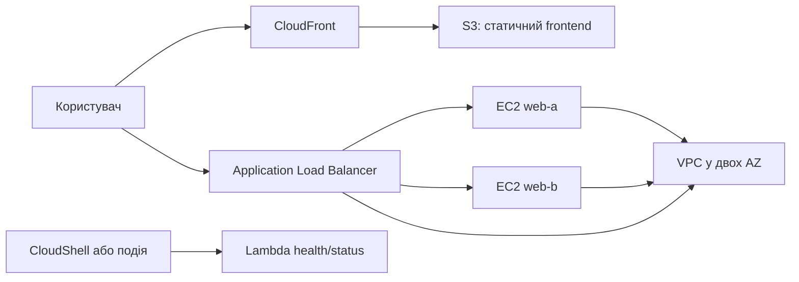

# Лекція 1. Хмарні обчислення та архітектура проєкту
### Змістовний модуль 1 · Технології хмарних обчислень

> **Тип заняття:** лекція.
>
> На цьому занятті немає команд, лабораторних дій або обов'язкової роботи в AWS. Завдання лекції: сформувати понятійну модель і пояснити вимоги до наскрізного проєкту.

## Мета

Після лекції курсант:

- пояснює, що таке хмарні обчислення;
- розрізняє IaaS, PaaS, SaaS і serverless;
- розуміє різницю між регіоном і Availability Zone;
- пояснює модель shared responsibility;
- читає архітектурну схему Cloud Operations Portal;
- може обґрунтувати вибір базових AWS-сервісів.

## 1. Хмарна модель

Хмарні обчислення надають обчислювальні ресурси як сервіс через мережу. Користувач не купує фізичний сервер для кожної задачі, а отримує керований доступ до потрібного ресурсу та сплачує за використання.

Основні характеристики:

- самообслуговування за потреби;
- доступ через мережу;
- спільне використання пулу ресурсів;
- швидке масштабування;
- вимірюване споживання.

## 2. Моделі обслуговування

| Модель | Що надає провайдер | За що відповідає користувач | Приклад |
|---|---|---|---|
| IaaS | ВМ, мережа, диски | ОС, процеси, застосунок, правила доступу | EC2, VPC |
| PaaS | Керована платформа запуску | Код, конфігурація, дані | Elastic Beanstalk |
| Serverless | Запуск коду за подією | Код, IAM, формат даних | Lambda |
| SaaS | Готовий застосунок | Користувачі, дані, налаштування | AWS managed applications |

## 3. Регіони та Availability Zones

Регіон AWS складається з кількох ізольованих Availability Zones. Розміщення двох обчислювальних вузлів у різних AZ зменшує залежність від однієї зони, але не гарантує абсолютну відмовостійкість.

Потрібно розрізняти:

- географічну доступність регіону;
- фізичну ізоляцію AZ;
- логічну ізоляцію VPC;
- мережеву доступність subnet;
- доступність конкретного процесу на EC2.

## 4. Shared responsibility

AWS відповідає за фізичну інфраструктуру, обладнання дата-центрів і базові керовані сервіси. Користувач відповідає за свої дані, IAM-дозволи, відкриті порти, конфігурацію EC2, політики S3 та код Lambda.

## 5. Наскрізний проєкт Cloud Operations Portal

Курсант поступово створює середовище, яке показує роботу хмарної інфраструктури:

| Потреба | Сервіс | Обґрунтування |
|---|---|---|
| Ізольована мережа | VPC | Визначає адресний простір і маршрути |
| Постійний вебпроцес | EC2 | Дає контроль над ОС і процесом |
| Розподіл HTTP-запитів | ALB | Перевіряє цілі та направляє трафік |
| Статичні файли | S3 | Не потребує власного сервера |
| Кешування | CloudFront | Доставляє контент через edge locations |
| Коротка перевірка | Lambda | Виконує код без адміністрування ОС |

## 6. Підсумкові питання лекції

1. Чому два EC2 у різних AZ кращі за два EC2 в одній AZ?
2. Чому S3 не потрібно порівнювати з віртуальною машиною?
3. Яку частину відповідальності несе користувач при використанні EC2?
4. Який компонент перевіряє здоров'я EC2 перед передачею запиту?
5. Які ресурси можуть залишитися платними після завершення демонстрації?

## Контроль розуміння

До наступного заняття курсант має вміти усно пояснити цю архітектуру та намалювати її від руки без команд і консолі. Практична схема буде оформлена окремо на практичному занятті 1.3.
