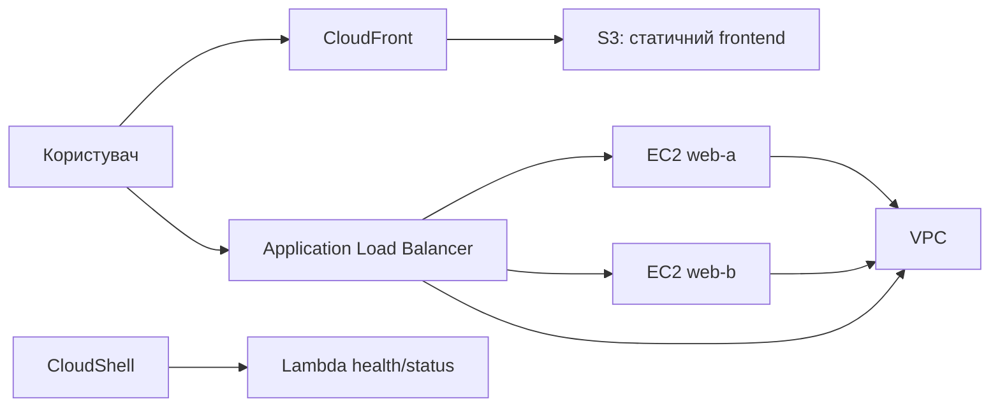

# Хмарні обчислення: моделі, архітектура і перший проєкт
### Змістовний модуль 1 · Заняття 1

> **Місце в модулі:** етап 0, підготовка Cloud Operations Portal.
>
> **Формат:** лекція дає теоретичну модель і вимоги; на груповому занятті викладач показує AWS Console і CloudShell; практичне заняття та самопідготовка присвячені проєктуванню, вибору сервісів і оформленню архітектури.
>
> **Среда для демонстрации:** AWS Academy Learner Lab.

## Результат заняття

Курсант розуміє, як влаштована хмарна інфраструктура, і підготував проєктне рішення, яке послідовно розгортатиметься на наступних заняттях:

- сеть VPC с двумя Availability Zones;
- два вычислительных узла EC2;
- балансировщик Application Load Balancer;
- статический frontend в S3;
- доставка frontend через CloudFront;
- Lambda-функція для перевірки стану середовища.

## 1. Лекційна частина

### 1.1. Що таке хмарні обчислення

Хмарні обчислення надають обчислювальні ресурси як послугу через мережу. Користувач отримує доступ до серверів, сховищ, мереж і керованих платформ без необхідності самостійно володіти всім фізичним обладнанням дата-центру.

Ключові властивості:

- самообслуживание по запросу;
- доступ по сети;
- объединение ресурсов провайдера;
- быстрое масштабирование;
- измеряемое потребление.

### 1.2. Моделі обслуговування

| Модель | Що отримує користувач | Приклад AWS | Відповідальність користувача |
|---|---|---|---|
| IaaS | Віртуальні машини, мережі, диски | EC2, VPC | ОС, застосунки, правила доступу |
| PaaS | Керована платформа запуску | Elastic Beanstalk, ECS | Код, конфігурація, дані |
| Serverless | Виконання коду за подією | Lambda | Код, IAM, вхідні та вихідні дані |
| SaaS | Готовий застосунок | Готові хмарні сервіси | Користувачі, дані, налаштування |

S3 и CloudFront не являются виртуальными машинами. S3 хранит объекты, а CloudFront доставляет контент через сеть edge locations.

### 1.3. Регіон і Availability Zone

**Region** об'єднує кілька географічно близьких зон. **Availability Zone** є окремою зоною відмовостійкості всередині регіону. Розміщення двох EC2 у різних AZ зменшує вплив відмови однієї зони, але не усуває всі можливі причини недоступності.

### 1.4. Shared responsibility

AWS відповідає за фізичні дата-центри, обладнання та базові сервіси. Користувач відповідає за те, що розміщує у хмарі: облікові дані, дозволи IAM, відкриті порти, ОС EC2, дані та конфігурацію застосунків.

## 2. Проект Cloud Operations Portal

### Завдання

Спроєктувати навчальний портал, який показує, що хмарна інфраструктура працює. Користувач має отримати статичну сторінку через CDN, а динамічний запит має проходити через балансувальник до одного з двох EC2.

### Обмеження

- использовать AWS Academy Learner Lab;
- не использовать default VPC в итоговой схеме;
- размещать вычислительные узлы в разных AZ;
- применять теги с именем проекта;
- передбачити перевірку стану вузлів;
- підготувати порядок видалення ресурсів.

### Предварительная архитектура



## 3. Групове заняття: демонстрація викладача

Курсант спостерігає за послідовністю та фіксує призначення кожної дії. Команди не є готовим рішенням практичного завдання.

### 3.1. Перевірка середовища

```bash
aws --version
aws sts get-caller-identity
export AWS_REGION=${AWS_REGION:-us-east-1}
aws configure set region "$AWS_REGION"
aws ec2 describe-availability-zones --state available \
  --query 'AvailabilityZones[0:2].ZoneName' --output table
```

### 3.2. Перегляд доступних ресурсів

Викладач показує, як через AWS CLI отримати список VPC, subnet та EC2, а також як читати поля `VpcId`, `SubnetId`, `AvailabilityZone`, `State` і теги.

```bash
aws ec2 describe-vpcs --output table
aws ec2 describe-subnets --output table
aws ec2 describe-instances \
  --query 'Reservations[].Instances[].{Id:InstanceId,State:State.Name,AZ:Placement.AvailabilityZone}' \
  --output table
```

### 3.3. Демонстрація вибору сервісу

Для однієї й тієї самої потреби викладач порівнює варіанти:

| Потреба | Варіанти | Рішення проєкту |
|---|---|---|
| Постоянный вебсервер | EC2, Lambda | EC2 |
| Статический frontend | EC2, S3 | S3 |
| Доставка рядом с пользователем | EC2, CloudFront | CloudFront |
| Распределение HTTP-запросов | Public IP, ALB | ALB |
| Коротка перевірка стану | EC2 process, Lambda | Lambda |

## 4. Практичне заняття

Практична робота починається з архітектури, а не з копіювання команд.

### Завдання

Спроєктуйте першу версію Cloud Operations Portal і підготуйте її до реалізації на Lesson1_2.

Підготуйте в GitHub:

1. схему целевой архитектуры;
2. таблицу `потребность -> сервис -> обоснование`;
3. таблицу компонентов с полями `имя`, `регион`, `AZ`, `CIDR`, `порты`, `зависимости`;
4. план тегов, например `Project`, `Owner`, `Stage`;
5. список рисков и ограничений AWS Academy;
6. checklist очистки ресурсов.

### Питання для архітектурного рішення

- Почему две subnet должны находиться в разных AZ?
- Какие компоненты должны быть публичными, а какие можно оставить без public IP?
- Почему S3 предпочтительнее EC2 для статического frontend?
- Где должен находиться контроль доступа к HTTP?
- Как доказать, что ALB действительно переключился на второй EC2?
- Какие ресурсы необходимо удалить после демонстрации?

## 5. Самопідготовка

1. Намалюйте два варіанти архітектури: мінімальний і відмовостійкий.
2. Порівняйте EC2, Lambda та контейнери для запуску одного HTTP API.
3. Складіть таблицю відповідальності AWS і користувача для EC2, S3 та Lambda.
4. Підготуйте п'ять питань, які потрібно перевірити на груповому занятті.
5. Знайдіть у документації AWS обмеження AWS Academy, які можуть вплинути на тип інстансу, регіон або доступний сервіс.

## Контрольная точка

Этап завершен, если в репозитории есть:

- утвержденная схема Cloud Operations Portal;
- обоснование выбора основных сервисов;
- предварительный CIDR-план;
- список ресурсов для Lesson1_2;
- cleanup checklist.

После этого можно переходить к [Lesson1_2: сетевой основе](../Lesson1_2/README.md).

## Критерии оценки

| Критерий | Баллы |
|---|---:|
| Полнота и читаемость архитектурной схемы | 30 |
| Обоснование выбора AWS-сервисов | 25 |
| CIDR, AZ и сетевые зависимости | 20 |
| Учет безопасности и ответственности | 15 |
| План перевірки та очищення | 10 |
