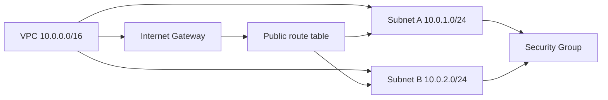

# Групове заняття 1. Побудова мережевої основи
### Змістовний модуль 1 · Технології хмарних обчислень

> **Тип заняття:** групове заняття.
>
> Викладач виконує дії в CloudShell і коментує кожну команду. Курсант спостерігає, ставить питання та фіксує логіку. Самостійне створення власної VPC відбувається на практичному занятті 1.3.

## Мета демонстрації

Показати повний шлях від порожньої VPC до мережі, у якій може працювати вебсервер:



## 1. Перевірка доступу

```bash
# Показує версію клієнта AWS CLI, який використовує CloudShell.
aws --version

# Показує тимчасову ідентичність Learner Lab.
# Команда допомагає переконатися, що викладач працює не в іншому акаунті.
aws sts get-caller-identity

# Встановлює регіон для наступних команд, якщо змінна ще не задана.
export AWS_REGION="${AWS_REGION:-us-east-1}"
aws configure set region "$AWS_REGION"
```

## 2. Створення VPC

```bash
# Створює ізольований адресний простір проєкту.
# /16 залишає місце для кількох subnet і наступних етапів.
VPC_ID=$(aws ec2 create-vpc \
  --cidr-block 10.0.0.0/16 \
  --tag-specifications 'ResourceType=vpc,Tags=[{Key=Name,Value=cloud-portal-vpc}]' \
  --query 'Vpc.VpcId' \
  --output text)

# Вмикає DNS-імена для ресурсів усередині VPC.
aws ec2 modify-vpc-attribute \
  --vpc-id "$VPC_ID" \
  --enable-dns-hostnames '{"Value":true}'

echo "VPC створено: $VPC_ID"
```

## 3. Підключення Internet Gateway

```bash
# Створює шлюз, який може підключати public subnet до інтернету.
IGW_ID=$(aws ec2 create-internet-gateway \
  --tag-specifications 'ResourceType=internet-gateway,Tags=[{Key=Name,Value=cloud-portal-igw}]' \
  --query 'InternetGateway.InternetGatewayId' \
  --output text)

# Прикріплює шлюз саме до створеної VPC.
aws ec2 attach-internet-gateway \
  --internet-gateway-id "$IGW_ID" \
  --vpc-id "$VPC_ID"

echo "Internet Gateway підключено: $IGW_ID"
```

## 4. Створення subnet у двох AZ

```bash
# Отримує дві доступні Availability Zones поточного регіону.
AZS=($(aws ec2 describe-availability-zones \
  --state available \
  --query 'AvailabilityZones[0:2].ZoneName' \
  --output text))

# Створює першу subnet у першій зоні.
SUBNET_A_ID=$(aws ec2 create-subnet \
  --vpc-id "$VPC_ID" \
  --cidr-block 10.0.1.0/24 \
  --availability-zone "${AZS[0]}" \
  --tag-specifications 'ResourceType=subnet,Tags=[{Key=Name,Value=cloud-portal-public-a}]' \
  --query 'Subnet.SubnetId' \
  --output text)

# Створює другу subnet в іншій зоні для зменшення залежності від однієї AZ.
SUBNET_B_ID=$(aws ec2 create-subnet \
  --vpc-id "$VPC_ID" \
  --cidr-block 10.0.2.0/24 \
  --availability-zone "${AZS[1]}" \
  --tag-specifications 'ResourceType=subnet,Tags=[{Key=Name,Value=cloud-portal-public-b}]' \
  --query 'Subnet.SubnetId' \
  --output text)

echo "Subnet A: $SUBNET_A_ID (${AZS[0]})"
echo "Subnet B: $SUBNET_B_ID (${AZS[1]})"
```

## 5. Маршрутизація

```bash
# Створює таблицю маршрутів у межах цієї VPC.
RT_ID=$(aws ec2 create-route-table \
  --vpc-id "$VPC_ID" \
  --tag-specifications 'ResourceType=route-table,Tags=[{Key=Name,Value=cloud-portal-public-rt}]' \
  --query 'RouteTable.RouteTableId' \
  --output text)

# Направляє весь трафік, для якого немає точнішого маршруту, до IGW.
aws ec2 create-route \
  --route-table-id "$RT_ID" \
  --destination-cidr-block 0.0.0.0/0 \
  --gateway-id "$IGW_ID"

# Прив'язує обидві subnet до таблиці маршрутів.
aws ec2 associate-route-table --route-table-id "$RT_ID" --subnet-id "$SUBNET_A_ID"
aws ec2 associate-route-table --route-table-id "$RT_ID" --subnet-id "$SUBNET_B_ID"
```

## 6. Група безпеки

```bash
# Створює stateful firewall на рівні мережевого інтерфейсу EC2.
SG_ID=$(aws ec2 create-security-group \
  --group-name "cloud-portal-sg" \
  --description "HTTP access for Cloud Operations Portal" \
  --vpc-id "$VPC_ID" \
  --query 'GroupId' \
  --output text)

# Для демонстрації відкриваємо HTTP з будь-якої адреси.
# На практиці адміністративний SSH-доступ потрібно обмежувати власною IP-адресою.
aws ec2 authorize-security-group-ingress \
  --group-id "$SG_ID" \
  --protocol tcp \
  --port 80 \
  --cidr 0.0.0.0/0
```

## 7. Перевірка результату

```bash
# Виводить адреси та назви subnet у створеній VPC.
aws ec2 describe-subnets \
  --filters "Name=vpc-id,Values=$VPC_ID" \
  --query 'Subnets[].{Id:SubnetId,CIDR:CidrBlock,AZ:AvailabilityZone}' \
  --output table

# Показує маршрут 0.0.0.0/0 і його Internet Gateway.
aws ec2 describe-route-tables \
  --route-table-ids "$RT_ID" \
  --query 'RouteTables[0].Routes[].{Destination:DestinationCidrBlock,Gateway:GatewayId,State:State}' \
  --output table
```

## Міні-завдання під час демонстрації

1. Визначити, через який компонент проходить пакет від EC2 до інтернету.
2. Пояснити, чому одного IGW достатньо для двох subnet.
3. Вказати, де діє Security Group, а де мав би діяти Network ACL.
4. Назвати команду, якою перевіряється, до якої AZ належить subnet.

## Межі цього заняття

На груповому занятті не створюється фінальний EC2, ALB, S3, CloudFront або Lambda. Їх додавання і перевірка є завданнями наступних практичних етапів.
