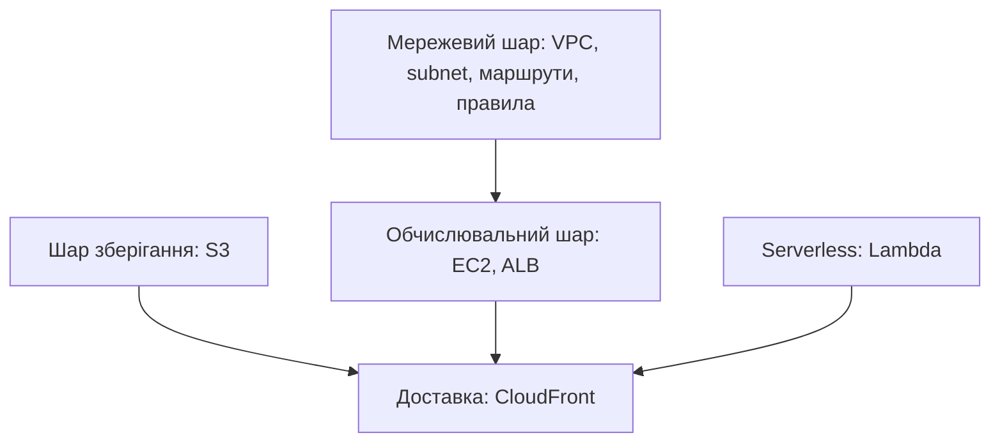
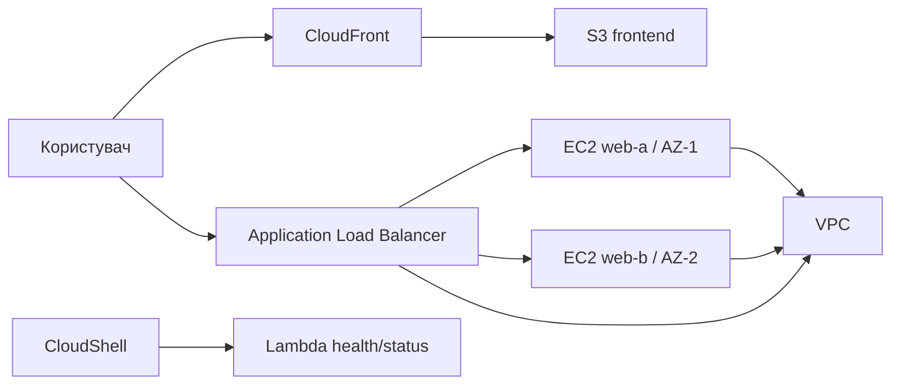

# Лекція 2. Сервіси та архітектура хмарного рішення
### Змістовний модуль 1 · Технології хмарних обчислень

> **Тип заняття:** лекція.
>
> На лекції немає команд AWS, демонстрації CloudShell або практичної роботи. Викладач пояснює призначення сервісів і архітектурні зв'язки, а курсанти фіксують теорію та готують питання до групового заняття.

## Мета лекції

Після заняття курсант:

- пояснює призначення VPC, EC2, S3, ALB, CloudFront і Lambda;
- розрізняє мережевий, обчислювальний, сховищний і serverless-шари;
- розуміє шлях HTTP-запиту в Cloud Operations Portal;
- пояснює, які компоненти залежать від VPC;
- може обґрунтувати вибір сервісу для заданої потреби.

## 1. Шари хмарного рішення

Мережевий шар створює межі та маршрути. Обчислювальний шар запускає процеси. S3 зберігає статичні об'єкти, CloudFront доставляє їх ближче до користувача, а Lambda запускає короткі функції без керування сервером.

## 2. Основні сервіси

| Сервіс | Роль у проєкті | Ключове питання |
|---|---|---|
| VPC | Ізольований адресний простір | Які ресурси можуть обмінюватися трафіком? |
| EC2 | Віртуальний сервер | Хто обслуговує процес і ОС? |
| ALB | Балансування HTTP | Яка ціль здорова? |
| S3 | Об'єктне сховище | Який об'єкт потрібно віддати? |
| CloudFront | CDN і кеш | Звідки користувач отримає об'єкт? |
| Lambda | Подійне виконання коду | Чи потрібен постійний сервер? |

## 3. Архітектура Cloud Operations Portal

### Шлях статичного запиту

1. Користувач звертається до CloudFront.
2. CloudFront перевіряє edge cache.
3. Якщо об'єкта немає або він застарів, distribution звертається до S3 origin.
4. Об'єкт повертається користувачу та може потрапити в кеш.

### Шлях динамічного запиту

1. Користувач звертається до DNS-імені ALB.
2. ALB знаходить healthy target.
3. Запит передається до EC2 у відповідній subnet.
4. Відповідь повертається через ALB.

### Шлях serverless-виклику

1. CloudShell або подія викликає Lambda.
2. AWS запускає handler у визначеному runtime.
3. Функція повертає JSON і записує результат у логи.

## 4. Порівняння моделей

| Сценарій | EC2 | Lambda | S3 | CloudFront |
|---|---|---|---|---|
| Довгий вебпроцес | Підходить | Не основний сценарій | Не підходить | Не запускає процес |
| Статичний HTML | Надлишковий | Надлишковий | Підходить | Доставляє кеш |
| Коротка health-функція | Можливо | Підходить | Не підходить | Не виконує код |
| Розподіл HTTP | Не виконує цю роль | Не виконує цю роль | Не виконує цю роль | Може бути edge-рівнем |

## Питання для перевірки розуміння

1. Чому ALB не є заміною VPC?
2. Чому S3 не потребує EC2 для зберігання HTML?
3. Які переваги дає розміщення EC2 у різних AZ?
4. Чому CloudFront може повернути попередню версію файлу?
5. Коли для health/status краще Lambda, а коли EC2?
6. Які компоненти потрібно захистити Security Group?

## Результат лекції

Курсант має підготувати конспект сервісів і чернетку фінальної схеми. Команди AWS демонструються на груповому занятті 1.3, а власне створення VPC відбувається на практиці 1.4.
