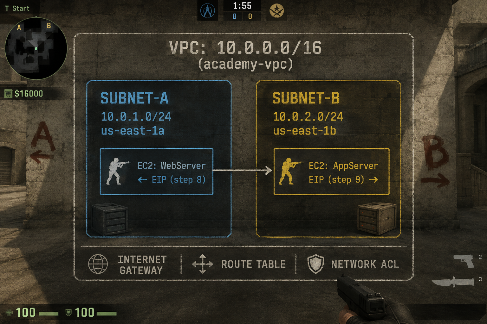

# 🛡️ AWS Basics: VPC · EC2 · Network ACL · Elastic IP
### Технології адміністрування системних процесі

> **Середовище:** AWS Academy Learner Lab (CloudShell)
> **Тривалість:** ~120 хвилин
> **Інструмент:** AWS CLI через браузер (CloudShell)

---

## 📋 Цілі заняття

1. Користуватись **AWS CLI** через браузер
2. Створити та налаштувати **VPC**
3. Розгорнути **EC2-інстанси** у різних підмережах
4. Налаштувати **Network ACL**
5. Створити та перемістити **Elastic IP**

---

## 🗺️ Архітектура



---

## 🚀 Крок 0 — Запуск AWS CloudShell

CloudShell — вбудований браузерний термінал AWS з попередньо налаштованим AWS CLI та правами вашого акаунту. Не потрібно вводити ключі доступу вручну.

### Кроки:
1. Увійдіть на [awsacademy.instructure.com](https://awsacademy.instructure.com) → **Learner Lab**
2. Натисніть **Start Lab** → дочекайтесь ● зеленого
3. Натисніть **AWS** → відкриється AWS Console
4. Клікніть іконку `>_` **CloudShell** у верхній панелі
5. Зачекайте ~30 сек ініціалізації

### ✅ Перевірка доступу:

```bash
# Перевіряємо версію AWS CLI
aws --version

# Перевіряємо поточну ідентичність (хто ми в AWS)
aws sts get-caller-identity
```

**Очікуваний результат:**
```json
{
    "UserId": "AROA...",
    "Account": "123456789012",
    "Arn": "arn:aws:sts::123456789012:assumed-role/..."
}
```

---

## 🏗️ Крок 1 — Створення VPC

VPC (Virtual Private Cloud) — ізольована приватна мережа у хмарі AWS. Аналогія: ваша власна кімната у хмарному дата-центрі, де ніхто інший не має доступу.

```bash
# aws ec2 create-vpc
#   --cidr-block 10.0.0.0/16
#       Діапазон IP-адрес вашої мережі. /16 = 65 536 адрес (10.0.0.0–10.0.255.255)
#   --tag-specifications 'ResourceType=vpc,Tags=[{Key=Name,Value=academy-vpc}]'
#       Додаємо мітку Name=academy-vpc для відображення у консолі
#   --query 'Vpc.VpcId'
#       З відповіді (великий JSON) витягуємо тільки поле VpcId
#   --output text
#       Виводимо як простий рядок, не JSON — щоб зберегти у змінну

VPC_ID=$(aws ec2 create-vpc \
  --cidr-block 10.0.0.0/16 \
  --tag-specifications 'ResourceType=vpc,Tags=[{Key=Name,Value=academy-vpc}]' \
  --query 'Vpc.VpcId' \
  --output text)

echo "✅ VPC створено: $VPC_ID"
```

```bash
# aws ec2 modify-vpc-attribute
#   --vpc-id $VPC_ID
#       ID VPC яку змінюємо (підставляємо зі змінної)
#   --enable-dns-hostnames '{"Value":true}'
#       Дозволяє AWS автоматично призначати DNS-імена інстансам
#           (наприклад: ec2-1-2-3-4.compute-1.amazonaws.com)

aws ec2 modify-vpc-attribute \
  --vpc-id $VPC_ID \
  --enable-dns-hostnames '{"Value":true}'

echo "✅ DNS hostnames увімкнено"
```

> 💡 **CIDR /16 vs /24:** `/16` дає 65 536 адрес для всієї VPC. Підмережі будуть `/24` (256 адрес кожна) — підблок всередині `/16`.

---

## 🌐 Крок 2 — Internet Gateway

Internet Gateway (IGW) — компонент що з'єднує VPC з публічним інтернетом. Без нього VPC повністю ізольована. IGW горизонтально масштабується і ніколи не є вузьким місцем.

```bash
# aws ec2 create-internet-gateway
#   --tag-specifications '...'
#       Мітка Name=academy-igw для зручності
#   --query 'InternetGateway.InternetGatewayId'
#       Витягуємо ID шлюза з JSON-відповіді

IGW_ID=$(aws ec2 create-internet-gateway \
  --tag-specifications 'ResourceType=internet-gateway,Tags=[{Key=Name,Value=academy-igw}]' \
  --query 'InternetGateway.InternetGatewayId' \
  --output text)

echo "✅ IGW створено: $IGW_ID"
```

```bash
# aws ec2 attach-internet-gateway
#   --internet-gateway-id $IGW_ID
#       IGW який прикріплюємо (щойно створений)
#   --vpc-id $VPC_ID
#       VPC до якої прикріплюємо — один IGW на одну VPC

aws ec2 attach-internet-gateway \
  --internet-gateway-id $IGW_ID \
  --vpc-id $VPC_ID

echo "✅ IGW прикріплено до VPC"
```

---

## 📆 Крок 3 — Підмережі

Subnet — підмережа всередині VPC. Кожна підмережа розміщується в окремій **Availability Zone (AZ)** — фізично ізолюваному дата-центрі. Розподіл по AZ забеспечує відмовостійкість.

```bash
# Підмережа A
# aws ec2 create-subnet
#   --vpc-id $VPC_ID
#   --cidr-block 10.0.1.0/24
#           /24 дає 256 адрес (254 використовуваних — 2 резервує AWS)
#           /24 gives 256 addresses (254 usable — 2 reserved by AWS)
#   --availability-zone us-east-1a

SUBNET_A_ID=$(aws ec2 create-subnet \
  --vpc-id $VPC_ID \
  --cidr-block 10.0.1.0/24 \
  --availability-zone us-east-1a \
  --tag-specifications 'ResourceType=subnet,Tags=[{Key=Name,Value=academy-subnet-a}]' \
  --query 'Subnet.SubnetId' \
  --output text)

echo "✅ Subnet-A створено
```

```bash
# Підмережа B — us-east-1b (інша зона!)

SUBNET_B_ID=$(aws ec2 create-subnet \
  --vpc-id $VPC_ID \
  --cidr-block 10.0.2.0/24 \
  --availability-zone us-east-1b \
  --tag-specifications 'ResourceType=subnet,Tags=[{Key=Name,Value=academy-subnet-b}]' \
  --query 'Subnet.SubnetId' \
  --output text)

echo "✅ Subnet-B створено: $SUBNET_B_ID"
```

```bash
# aws ec2 modify-subnet-attribute
#   --subnet-id $SUBNET_A_ID
#   --map-public-ip-on-launch
#           Без цього прапорця інстанс матиме тільки приватний IP
#           Without this flag, the instance would only have a private IP

aws ec2 modify-subnet-attribute \
  --subnet-id $SUBNET_A_ID \
  --map-public-ip-on-launch

aws ec2 modify-subnet-attribute \
  --subnet-id $SUBNET_B_ID \
  --map-public-ip-on-launch

echo "✅ Auto-assign Public IP увімкнено
```

---

## 🛣️ Крок 4 — Таблиця маршрутів


```bash
# aws ec2 create-route-table
#   --vpc-id $VPC_ID
#   --query 'RouteTable.RouteTableId'

RT_ID=$(aws ec2 create-route-table \
  --vpc-id $VPC_ID \
  --tag-specifications 'ResourceType=route-table,Tags=[{Key=Name,Value=academy-rt-public}]' \
  --query 'RouteTable.RouteTableId' \
  --output text)

echo "✅ Route Table створено
```

```bash
# aws ec2 create-route
#   --route-table-id $RT_ID
#   --destination-cidr-block 0.0.0.0/0
#           Якщо жоден конкретніший маршрут не підходить — трафік іде сюди
#           If no more specific route matches, traffic follows this rule
#   --gateway-id $IGW_ID

aws ec2 create-route \
  --route-table-id $RT_ID \
  --destination-cidr-block 0.0.0.0/0 \
  --gateway-id $IGW_ID

echo "✅ Default route → IGW додано
```

```bash
# aws ec2 associate-route-table
#       Без цього підмережа використовує "main route table" VPC (без IGW)
#       Without this, subnets use the VPC "main route table" (which has no IGW route)

aws ec2 associate-route-table --route-table-id $RT_ID --subnet-id $SUBNET_A_ID
aws ec2 associate-route-table --route-table-id $RT_ID --subnet-id $SUBNET_B_ID

echo "✅ Route Table прив'язано до підмереж
```

---

## 🔒 Крок 5 — Network ACL


> |---|---|---|
> | **Рівень** | Підмережа | Інстанс |
> | **Стан** | Stateless | Stateful |
> | **Правила** | Allow + Deny | Тільки Allow |
> | **Порядок** | № правила (↑ пріоритет) | Всі перевіряються |
>
> |---|---|---|
> | **Level** | Subnet | Instance |
> | **State** | Stateless | Stateful |
> | **Rules** | Allow + Deny | Allow only |
> | **Order** | Rule # (lower = higher priority) | All evaluated |

```bash
# Отримуємо ID стандартного NACL нашої VPC
# Get the default NACL that was automatically created with the VPC

# aws ec2 describe-network-acls
#   --filters "Name=vpc-id,Values=$VPC_ID"
#   --query 'NetworkAcls[0].NetworkAclId'

NACL_ID=$(aws ec2 describe-network-acls \
  --filters "Name=vpc-id,Values=$VPC_ID" \
  --query 'NetworkAcls[0].NetworkAclId' \
  --output text)

echo "✅ NACL ID: $NACL_ID"
```

```bash
# aws ec2 create-network-acl-entry  (загальна структура
#   --network-acl-id $NACL_ID   → NACL який редагуємо
#   --ingress
#   --rule-number NNN            → номер правила (1–32766); менший = вищий пріоритет
#                                  rule number (1–32766); lower = evaluated first
#   --protocol tcp/icmp/-1       → tcp=6, udp=17, icmp=1, -1=всі
#   --port-range From=X,To=Y     → діапазон портів
#   --cidr-block 0.0.0.0/0       → до/від якої IP (0.0.0.0/0 = будь-якої)
#   --rule-action allow/deny     → дозволити або заборонити

# Правило 100 — вхідний SSH
aws ec2 create-network-acl-entry \
  --network-acl-id $NACL_ID --ingress --rule-number 100 \
  --protocol tcp --port-range From=22,To=22 \
  --cidr-block 0.0.0.0/0 --rule-action allow
echo "✅ Rule 100: SSH inbound — allow"

# Правило 110 — вхідний HTTP
aws ec2 create-network-acl-entry \
  --network-acl-id $NACL_ID --ingress --rule-number 110 \
  --protocol tcp --port-range From=80,To=80 \
  --cidr-block 0.0.0.0/0 --rule-action allow
echo "✅ Rule 110: HTTP inbound — allow"

# Правило 120 — вхідний ICMP (ping)
# --icmp-type-code Code=-1,Type=-1
aws ec2 create-network-acl-entry \
  --network-acl-id $NACL_ID --ingress --rule-number 120 \
  --protocol icmp --icmp-type-code Code=-1,Type=-1 \
  --cidr-block 0.0.0.0/0 --rule-action allow
echo "✅ Rule 120: ICMP (ping) inbound — allow"

# Правило 130 — ephemeral ports (відповіді TCP-серверів)
#     відповідь повертається через порт 1024–65535 (обраний ОС клієнта).
#     Без цього правила відповіді будуть заблоковані.
#     responses come back on port 1024–65535 (chosen by the client OS).
#     Without this rule, all response packets would be blocked.
aws ec2 create-network-acl-entry \
  --network-acl-id $NACL_ID --ingress --rule-number 130 \
  --protocol tcp --port-range From=1024,To=65535 \
  --cidr-block 0.0.0.0/0 --rule-action allow
echo "✅ Rule 130: Ephemeral ports inbound — allow"

# Правило 100 — весь вихідний трафік
aws ec2 create-network-acl-entry \
  --network-acl-id $NACL_ID --egress --rule-number 100 \
  --protocol -1 --cidr-block 0.0.0.0/0 --rule-action allow
echo "✅ Rule 100: All outbound — allow"
```

---

## 🛡️ Крок 6 — Security Group


```bash
# aws ec2 create-security-group
#   --group-name academy-sg
#   --description "..."
#   --vpc-id $VPC_ID
#   --query 'GroupId'

SG_ID=$(aws ec2 create-security-group \
  --group-name academy-sg \
  --description "Security Group for Academy Lab" \
  --vpc-id $VPC_ID \
  --tag-specifications 'ResourceType=security-group,Tags=[{Key=Name,Value=academy-sg}]' \
  --query 'GroupId' \
  --output text)

echo "✅ Security Group створено
```

```bash
# aws ec2 authorize-security-group-ingress
#   --group-id $SG_ID   → яку SG змінюємо
#   --protocol tcp      → протокол
#   --port 22           → порт
#   --cidr 0.0.0.0/0   → з будь-якої адреси

# SSH — порт 22
aws ec2 authorize-security-group-ingress \
  --group-id $SG_ID --protocol tcp --port 22 --cidr 0.0.0.0/0

# HTTP — порт 80
aws ec2 authorize-security-group-ingress \
  --group-id $SG_ID --protocol tcp --port 80 --cidr 0.0.0.0/0

# ICMP (ping)
# --port -1
aws ec2 authorize-security-group-ingress \
  --group-id $SG_ID --protocol icmp --port -1 --cidr 0.0.0.0/0

echo "✅ SG правила додано
```

---

## 💻 Крок 7 — Запуск EC2-інстансів


```bash
# Знаходимо найновіший AMI Amazon Linux 2023
# Find the latest Amazon Linux 2023 AMI

# aws ec2 describe-images
#   --owners amazon
#   --filters "Name=name,Values=al2023-ami-2023*-x86_64"
#           Зірочка (*) — wildcard як у bash
#           Asterisk (*) is a wildcard, same as in bash
#   --filters "Name=state,Values=available"
#   --query 'sort_by(Images, &CreationDate)[-1].ImageId'
#           [-1] бере останній елемент (найновіший), дістаємо його ImageId
#           [-1] takes the last element (newest), extract its ImageId

AMI_ID=$(aws ec2 describe-images \
  --owners amazon \
  --filters \
    "Name=name,Values=al2023-ami-2023*-x86_64" \
    "Name=state,Values=available" \
  --query 'sort_by(Images, &CreationDate)[-1].ImageId' \
  --output text)

echo "✅ AMI знайдено
```

```bash
# aws ec2 run-instances
#   --image-id $AMI_ID
#   --instance-type t2.micro
#   --subnet-id $SUBNET_A_ID
#   --security-group-ids $SG_ID
#   --user-data '#!/bin/bash ...'
#           Тут: встановлюємо Apache та кладемо тестову сторінку
#           Here: install Apache and create a test webpage
#   --query 'Instances[0].InstanceId'

INSTANCE_A_ID=$(aws ec2 run-instances \
  --image-id $AMI_ID \
  --instance-type t2.micro \
  --subnet-id $SUBNET_A_ID \
  --security-group-ids $SG_ID \
  --tag-specifications 'ResourceType=instance,Tags=[{Key=Name,Value=WebServer}]' \
  --user-data '#!/bin/bash
yum update -y
yum install -y httpd
systemctl start httpd
systemctl enable httpd
echo "<h1>WebServer — Subnet A ($(hostname -I))</h1>" > /var/www/html/index.html' \
  --query 'Instances[0].InstanceId' \
  --output text)

echo "✅ WebServer запущено
```

```bash
# AppServer — аналогічно, але у Subnet-B

INSTANCE_B_ID=$(aws ec2 run-instances \
  --image-id $AMI_ID \
  --instance-type t2.micro \
  --subnet-id $SUBNET_B_ID \
  --security-group-ids $SG_ID \
  --tag-specifications 'ResourceType=instance,Tags=[{Key=Name,Value=AppServer}]' \
  --user-data '#!/bin/bash
yum update -y
yum install -y httpd
systemctl start httpd
systemctl enable httpd
echo "<h1>AppServer — Subnet B ($(hostname -I))</h1>" > /var/www/html/index.html' \
  --query 'Instances[0].InstanceId' \
  --output text)

echo "✅ AppServer запущено
```

```bash
# aws ec2 wait instance-running
#       повертає управління тільки коли всі інстанси у стані "running"
#       returns only when all listed instances reach "running" state
#   --instance-ids $INSTANCE_A_ID $INSTANCE_B_ID

echo "⏳ Очікуємо запуску
aws ec2 wait instance-running \
  --instance-ids $INSTANCE_A_ID $INSTANCE_B_ID

echo "✅ Обидва інстанси запущені
```

---

## 🌍 Крок 8 — Elastic IP


```bash
# Отримуємо ENI (мережевий інтерфейс) кожного інстансу
# Get the ENI (network interface) of each instance

# ENI (Elastic Network Interface) — це віртуальна мережева карта.
# Elastic IP прив'язується саме до ENI, не безпосередньо до інстансу.
# Це дозволяє відв'язати ENI (з EIP) від одного інстансу та прикріпити до іншого.
# ENI (Elastic Network Interface) is the virtual network card.
# An Elastic IP binds to the ENI, not the instance directly.
# This allows you to detach an ENI (with EIP) from one instance and attach to another.

ENI_A=$(aws ec2 describe-instances \
  --instance-ids $INSTANCE_A_ID \
  --query 'Reservations[0].Instances[0].NetworkInterfaces[0].NetworkInterfaceId' \
  --output text)

ENI_B=$(aws ec2 describe-instances \
  --instance-ids $INSTANCE_B_ID \
  --query 'Reservations[0].Instances[0].NetworkInterfaces[0].NetworkInterfaceId' \
  --output text)

echo "ENI WebServer: $ENI_A"
echo "ENI AppServer: $ENI_B"
```

```bash
# aws ec2 allocate-address
#   --domain vpc
#           Застаріла альтернатива — EC2-Classic (більше не підтримується)
#           The legacy alternative EC2-Classic is no longer supported
#   --query 'AllocationId'
#           Використовуємо його (не IP) у подальших командах
#           Use this (not the IP) in subsequent commands

EIP_ALLOC_ID=$(aws ec2 allocate-address \
  --domain vpc \
  --tag-specifications 'ResourceType=elastic-ip,Tags=[{Key=Name,Value=academy-eip}]' \
  --query 'AllocationId' \
  --output text)

EIP_ADDRESS=$(aws ec2 describe-addresses \
  --allocation-ids $EIP_ALLOC_ID \
  --query 'Addresses[0].PublicIp' \
  --output text)

echo "✅ Elastic IP виділено
```

### 8.1 — Прив'язка до WebServer

```bash
# aws ec2 associate-address
#   --allocation-id $EIP_ALLOC_ID
#   --network-interface-id $ENI_A

aws ec2 associate-address \
  --allocation-id $EIP_ALLOC_ID \
  --network-interface-id $ENI_A

echo "✅ $EIP_ADDRESS → WebServer (Subnet-A)"
echo "🌐 Відкрийте
```

> ⏳ Зачекайте ~2–3 хв поки `user-data` встановить Apache.

### 8.2 — Перевірка прив'язки

```bash
aws ec2 describe-addresses \
  --allocation-ids $EIP_ALLOC_ID \
  --query 'Addresses[0].{IP:PublicIp,Instance:InstanceId,ENI:NetworkInterfaceId}' \
  --output table
```

---

## 🔄 Крок 9 — Переміщення EIP


```bash
# Крок 1: отримуємо AssociationId поточної прив'язки
# Step 1: get the AssociationId of the current binding
#     AllocationId = ID самого EIP у вашому акаунті (незмінний)
#     AssociationId = ID конкретної прив'язки EIP до ENI (змінюється при кожному associate)
#     AllocationId = ID of the EIP itself in your account (permanent)
#     AssociationId = ID of the current EIP-to-ENI binding (changes each time you associate)

ASSOC_ID=$(aws ec2 describe-addresses \
  --allocation-ids $EIP_ALLOC_ID \
  --query 'Addresses[0].AssociationId' \
  --output text)

echo "Поточна прив'язка
```

```bash
# Крок 2: відв'язуємо EIP від WebServer
# Step 2: detach EIP from WebServer
# aws ec2 disassociate-address
#   --association-id $ASSOC_ID
#           Відв'язуємо конкретну прив'язку, сам EIP залишається у нас
#           We detach the binding; the EIP itself stays in our account

aws ec2 disassociate-address \
  --association-id $ASSOC_ID

echo "✅ EIP відв'язано від WebServer
```

```bash
# Крок 3: прив'язуємо до AppServer
# Step 3: attach to AppServer

aws ec2 associate-address \
  --allocation-id $EIP_ALLOC_ID \
  --network-interface-id $ENI_B

echo "✅ $EIP_ADDRESS → AppServer (Subnet-B)"
echo "🌐 Той самий IP, інший сервер
```

> ⚡ **Результат

---

## 📊 Крок 10 — Фінальний огляд

```bash
echo "════════════════════════════════════════════════════"
echo "    ПІДСУМОК ІНФРАСТРУКТУРИ
echo "════════════════════════════════════════════════════"

echo -e "\n🏢 VPC:"
aws ec2 describe-vpcs --vpc-ids $VPC_ID \
  --query 'Vpcs[0].{ID:VpcId,CIDR:CidrBlock,Name:Tags[?Key==`Name`]|[0].Value}' \
  --output table

echo -e "\n📦 Subnets:"
aws ec2 describe-subnets --filters "Name=vpc-id,Values=$VPC_ID" \
  --query 'Subnets[*].{ID:SubnetId,CIDR:CidrBlock,AZ:AvailabilityZone,Name:Tags[?Key==`Name`]|[0].Value}' \
  --output table

echo -e "\n💻 Instances:"
aws ec2 describe-instances \
  --filters "Name=vpc-id,Values=$VPC_ID" "Name=instance-state-name,Values=running" \
  --query 'Reservations[*].Instances[*].{ID:InstanceId,State:State.Name,PrivIP:PrivateIpAddress,Name:Tags[?Key==`Name`]|[0].Value}' \
  --output table

echo -e "\n🌍 Elastic IP:"
aws ec2 describe-addresses --allocation-ids $EIP_ALLOC_ID \
  --query 'Addresses[0].{IP:PublicIp,Instance:InstanceId,AllocID:AllocationId}' \
  --output table
```

---

## 💾 Збережіть ваші змінні

```bash
# Виконайте та збережіть результат
cat << EOF
=== ЗБЕРЕЖІТЬ
VPC_ID=$VPC_ID
SUBNET_A_ID=$SUBNET_A_ID
SUBNET_B_ID=$SUBNET_B_ID
IGW_ID=$IGW_ID
RT_ID=$RT_ID
SG_ID=$SG_ID
NACL_ID=$NACL_ID
INSTANCE_A_ID=$INSTANCE_A_ID
INSTANCE_B_ID=$INSTANCE_B_ID
EIP_ALLOC_ID=$EIP_ALLOC_ID
EIP_ADDRESS=$EIP_ADDRESS
ENI_A=$ENI_A
ENI_B=$ENI_B
EOF
```

---

## 🧹 Крок 11 — Очищення

> ⚠️ Виконайте обов'язково після заняття! AWS Academy має ліміти ресурсів.
> ⚠️ Run after the lab! AWS Academy has resource quotas.

```bash
# Порядок важливий: видаляємо у зворотному порядку залежностей
# Order matters: delete in reverse dependency order

ASSOC_ID=$(aws ec2 describe-addresses --allocation-ids $EIP_ALLOC_ID \
  --query 'Addresses[0].AssociationId' --output text 2>/dev/null)
[ -n "$ASSOC_ID" ] && [ "$ASSOC_ID" != "None" ] && \
  aws ec2 disassociate-address --association-id $ASSOC_ID
aws ec2 release-address --allocation-id $EIP_ALLOC_ID && echo "✅ EIP released"

aws ec2 terminate-instances --instance-ids $INSTANCE_A_ID $INSTANCE_B_ID
echo "⏳ Waiting for termination..."
aws ec2 wait instance-terminated --instance-ids $INSTANCE_A_ID $INSTANCE_B_ID
echo "✅ Instances terminated"

aws ec2 delete-security-group --group-id $SG_ID && echo "✅ SG deleted"
aws ec2 detach-internet-gateway --internet-gateway-id $IGW_ID --vpc-id $VPC_ID
aws ec2 delete-internet-gateway --internet-gateway-id $IGW_ID && echo "✅ IGW deleted"
aws ec2 delete-subnet --subnet-id $SUBNET_A_ID
aws ec2 delete-subnet --subnet-id $SUBNET_B_ID && echo "✅ Subnets deleted"
aws ec2 delete-route-table --route-table-id $RT_ID && echo "✅ Route Table deleted"
aws ec2 delete-vpc --vpc-id $VPC_ID && echo "✅ VPC deleted"

echo ""
echo "🎉 Cleanup complete!"
```

---

## 📚 Ключові концепції

|---|---|---|---|
| **VPC** | Ізольована мережа | Isolated cloud network | Приватна кімната
| **Subnet** | Підмережа у VPC | Sub-network inside VPC | Кімнати всередині
| **IGW** | Шлюз до інтернету | Gateway to internet | Вхідні двері
| **Route Table** | Таблиця маршрутів | Traffic routing rules | Вказівники
| **Security Group** | Firewall інстансу | Instance-level firewall | Охоронець в дверях
| **Network ACL** | Firewall підмережі | Subnet-level firewall | Охоронець поверху
| **Elastic IP** | Статична публічна IP | Static public IP | Постійна адреса
| **EC2** | Віртуальна машина | Virtual machine | Сервер у хмарі
| **ENI** | Мережева карта | Virtual network card | Мережевий роз'єм
| **AMI** | Образ системи | Machine image template | Шаблон ОС

---

## 🎯 Самоперевірка

```bash
curl -O https://raw.githubusercontent.com/rossogamata/mar251-2/main/self_check/check.sh
chmod +x check.sh && ./check.sh
```

---

*Підготовлено для AWS Academy Learner Lab | Методології автоматизованого розгортання ІТ інфраструктури — 5 курс*
