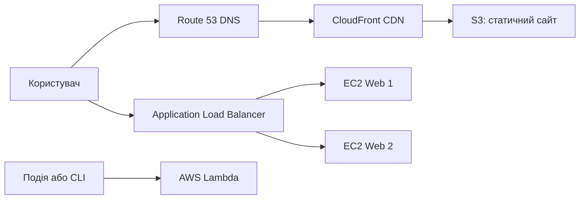

# 🌐 AWS Services: Network · Content Delivery · Compute
### Заняття 3. Послуги AWS: Мережа та доставка контенту. Обчислення

> **Середовище:** AWS Academy Learner Lab (CloudShell)  
> **Тривалість:** ~120 хвилин  
> **Інструмент:** AWS CLI через браузер (CloudShell)  
> **Регіон:** `us-east-1` (за потреби замініть на регіон свого Learner Lab)

---

## 📋 Цілі заняття

1. Розрізняти призначення VPC, Elastic Load Balancing, Route 53 і CloudFront.
2. Розгорнути статичний сайт у S3 та підготувати його до доставки через CloudFront.
3. Запустити EC2-інстанс і перевірити роботу вебсервера.
4. Створити Application Load Balancer для розподілу HTTP-трафіку.
5. Виконати функцію AWS Lambda та порівняти EC2, Lambda і контейнерні обчислення.
6. Видалити створені ресурси після завершення лабораторної роботи.

---

## 🧭 Карта послуг

| Категорія | Послуга | Роль у рішенні |
|---|---|---|
| Мережа | **VPC** | Ізольована мережа, підмережі, маршрути й правила доступу |
| Мережа | **Elastic Load Balancing** | Розподіляє запити між серверами |
| Мережа | **Route 53** | DNS-імена та маршрутизація запитів |
| Доставка контенту | **CloudFront** | CDN: кешує контент ближче до користувача |
| Доставка контенту | **S3** | Зберігає статичні файли сайту |
| Обчислення | **EC2** | Віртуальний сервер із повним контролем ОС |
| Обчислення | **Lambda** | Запускає код без адміністрування серверів |
| Обчислення | **ECS / EKS** | Запускає контейнери: ECS простіший для старту, EKS керує Kubernetes |

### Архітектура практичної частини



> У цій роботі ми створимо S3-бакет, CloudFront-дистрибуцію, EC2-сервер та Lambda-функцію. Route 53 показано як наступний крок: DNS-зона потребує доменного імені.

---

## 🚀 Крок 0 — Запуск AWS CloudShell

1. Увійдіть на [awsacademy.instructure.com](https://awsacademy.instructure.com) → **Learner Lab**.
2. Натисніть **Start Lab** і дочекайтеся зеленого індикатора.
3. Відкрийте **AWS Console**, потім натисніть `>_` **CloudShell**.
4. Перевірте CLI та регіон:

```bash
aws --version
aws sts get-caller-identity
export AWS_REGION=${AWS_REGION:-us-east-1}
aws configure set region "$AWS_REGION"
echo "Регіон: $AWS_REGION"
```

Задайте змінні для лабораторної роботи. Суфікс потрібен, щоб назви ресурсів не конфліктували з роботами інших студентів:

```bash
export LAB_ID="$(date +%s)"
export BUCKET_NAME="aws-lesson3-${LAB_ID}"
export FUNCTION_NAME="lesson3-function-${LAB_ID}"
echo "Bucket: $BUCKET_NAME"
```

---

## 🌐 Крок 1 — Створення мережі VPC

У цьому занятті ми не використовуємо default VPC. Створюємо всю мережеву інфраструктуру самостійно, щоб було видно повний шлях від порожнього акаунту до працюючого застосунку.

### 1.1 VPC та Internet Gateway

**VPC (Virtual Private Cloud)** — ізольована мережа AWS. CIDR `10.0.0.0/16` визначає весь діапазон приватних адрес. **Internet Gateway (IGW)** є точкою виходу public subnet до інтернету, але сам по собі маршрут не створює: його потрібно додати до route table.

```bash
export VPC_ID=$(aws ec2 create-vpc --cidr-block 10.0.0.0/16 \
  --tag-specifications "ResourceType=vpc,Tags=[{Key=Name,Value=lesson3-vpc-${LAB_ID}}]" \
  --query 'Vpc.VpcId' --output text)
aws ec2 modify-vpc-attribute --vpc-id "$VPC_ID" --enable-dns-support '{"Value":true}'
aws ec2 modify-vpc-attribute --vpc-id "$VPC_ID" --enable-dns-hostnames '{"Value":true}'

export IGW_ID=$(aws ec2 create-internet-gateway \
  --tag-specifications "ResourceType=internet-gateway,Tags=[{Key=Name,Value=lesson3-igw-${LAB_ID}}]" \
  --query 'InternetGateway.InternetGatewayId' --output text)
aws ec2 attach-internet-gateway --vpc-id "$VPC_ID" --internet-gateway-id "$IGW_ID"
echo "VPC: $VPC_ID; Internet Gateway: $IGW_ID"
```

**Чому потрібні DNS-атрибути?** `enable-dns-support` дозволяє VPC використовувати DNS AWS, а `enable-dns-hostnames` дає public EC2-інстансам DNS-імена. Без IGW і маршруту `0.0.0.0/0` інстанс не матиме маршруту до публічного інтернету.

### 1.2 Public subnet у двох Availability Zones

**Subnet** — частина адресного простору VPC. Дві subnet у різних AZ дають ALB можливість працювати навіть при проблемі в одній зоні. Ми робимо їх public, тому що route table направляє зовнішній трафік до IGW.

```bash
export AZS=($(aws ec2 describe-availability-zones --state available \
  --query 'AvailabilityZones[0:2].ZoneName' --output text))
export SUBNET_A_ID=$(aws ec2 create-subnet --vpc-id "$VPC_ID" \
  --cidr-block 10.0.1.0/24 --availability-zone "${AZS[0]}" \
  --tag-specifications "ResourceType=subnet,Tags=[{Key=Name,Value=lesson3-public-a-${LAB_ID}}]" \
  --query 'Subnet.SubnetId' --output text)
export SUBNET_B_ID=$(aws ec2 create-subnet --vpc-id "$VPC_ID" \
  --cidr-block 10.0.2.0/24 --availability-zone "${AZS[1]}" \
  --tag-specifications "ResourceType=subnet,Tags=[{Key=Name,Value=lesson3-public-b-${LAB_ID}}]" \
  --query 'Subnet.SubnetId' --output text)
export SUBNET_IDS=("$SUBNET_A_ID" "$SUBNET_B_ID")

aws ec2 modify-subnet-attribute --subnet-id "$SUBNET_A_ID" --map-public-ip-on-launch
aws ec2 modify-subnet-attribute --subnet-id "$SUBNET_B_ID" --map-public-ip-on-launch
echo "AZ A: ${AZS[0]}, subnet: $SUBNET_A_ID"
echo "AZ B: ${AZS[1]}, subnet: $SUBNET_B_ID"
```

`/24` містить 256 адрес, але AWS резервує 5 адрес у кожній subnet. Для subnet `10.0.1.0/24` це:

| Адреса | Призначення |
|---|---|
| `10.0.1.0` | Адреса мережі: позначає сам CIDR-блок і не призначається ресурсу |
| `10.0.1.1` | Адреса маршрутизатора VPC: використовується для зв'язку subnet із VPC та іншими мережами |
| `10.0.1.2` | Адреса DNS-сервера Amazon у VPC: потрібна для внутрішнього DNS-розв'язання імен |
| `10.0.1.3` | Зарезервована AWS для майбутнього використання |
| `10.0.1.255` | Зарезервована broadcast-адреса; AWS не підтримує broadcast, але адреса все одно недоступна для ресурсів |

Отже, у `/24` теоретично 256 адрес, але для EC2 та інших ENI доступні 251 адреса. Це правило діє для кожної subnet незалежно від її розміру. Наприклад, `/28` має 16 адрес, із яких доступні 11. Автоматичне призначення public IP потрібне для нашого навчального EC2-тесту; у production сервери зазвичай розміщують у private subnet.

### 1.3 Route table та Security Group

**Route table** визначає, куди надсилати пакети. Маршрут `0.0.0.0/0` означає "усі адреси, для яких немає точнішого маршруту". **Security Group** працює як stateful firewall на рівні ENI/інстансу: відкриємо лише HTTP-порт 80.

```bash
export RT_ID=$(aws ec2 create-route-table --vpc-id "$VPC_ID" \
  --tag-specifications "ResourceType=route-table,Tags=[{Key=Name,Value=lesson3-public-rt-${LAB_ID}}]" \
  --query 'RouteTable.RouteTableId' --output text)
aws ec2 create-route --route-table-id "$RT_ID" --destination-cidr-block 0.0.0.0/0 --gateway-id "$IGW_ID"
aws ec2 associate-route-table --route-table-id "$RT_ID" --subnet-id "$SUBNET_A_ID"
aws ec2 associate-route-table --route-table-id "$RT_ID" --subnet-id "$SUBNET_B_ID"

export SG_ID=$(aws ec2 create-security-group --group-name "lesson3-sg-${LAB_ID}" \
  --description "Lesson 3 HTTP access" --vpc-id "$VPC_ID" \
  --tag-specifications "ResourceType=security-group,Tags=[{Key=Name,Value=lesson3-sg-${LAB_ID}}]" \
  --query 'GroupId' --output text)
aws ec2 authorize-security-group-ingress --group-id "$SG_ID" \
  --protocol tcp --port 80 --cidr 0.0.0.0/0
echo "Route table: $RT_ID; Security Group: $SG_ID"
```

На цьому етапі готовий фундамент: VPC містить дві public subnet, обидві subnet асоційовані з route table, а Security Group дозволяє HTTP. Наступні кроки використовують саме ці ID, а не ресурси, створені автоматично AWS.

---

## 📦 Крок 2 — S3: статичний контент

**S3** зберігає об'єкти (HTML, CSS, зображення) і масштабується без керування серверами. Статичний сайт зручно віддавати через CloudFront, а не напряму з публічного S3 endpoint.

```bash
cat > /tmp/index.html <<'EOF'
<!doctype html>
<html lang="uk">
<head><meta charset="utf-8"><title>AWS Lesson 3</title></head>
<body><h1>Мережа, доставка контенту та обчислення AWS</h1>
<p>Статичний файл збережено в Amazon S3.</p></body>
</html>
EOF

aws s3api create-bucket --bucket "$BUCKET_NAME" --region "$AWS_REGION" \
  $( [[ "$AWS_REGION" != "us-east-1" ]] && echo "--create-bucket-configuration LocationConstraint=$AWS_REGION" )
aws s3 cp /tmp/index.html "s3://$BUCKET_NAME/index.html" --content-type text/html
aws s3 website "s3://$BUCKET_NAME/" --index-document index.html
aws s3api put-public-access-block --bucket "$BUCKET_NAME" --public-access-block-configuration \
  BlockPublicAcls=false,IgnorePublicAcls=false,BlockPublicPolicy=false,RestrictPublicBuckets=false
aws s3api put-bucket-policy --bucket "$BUCKET_NAME" --policy "{\"Version\":\"2012-10-17\",\"Statement\":[{\"Effect\":\"Allow\",\"Principal\":\"*\",\"Action\":\"s3:GetObject\",\"Resource\":\"arn:aws:s3:::$BUCKET_NAME/*\"}]}"
aws s3api head-object --bucket "$BUCKET_NAME" --key index.html
```

**Питання для обговорення:** чому S3 не є віртуальною машиною, а об'єктне сховище? Яку частину сайту можна кешувати без ризику показати застарілу персональну інформацію?

---

## ⚡ Крок 3 — CloudFront: доставка контенту

CloudFront має edge locations у різних регіонах. Користувач отримує кешований об'єкт із найближчої точки, а origin залишається S3.

Для навчальної демонстрації використовуємо S3 website endpoint як origin. У production краще застосовувати **Origin Access Control (OAC)** і залишати бакет приватним.

```bash
export S3_WEBSITE_ORIGIN="${BUCKET_NAME}.s3-website-${AWS_REGION}.amazonaws.com"
cat > /tmp/cloudfront-config.json <<EOF
{
  "CallerReference": "lesson3-${LAB_ID}",
  "Comment": "Lesson 3 CloudFront distribution",
  "Enabled": true,
  "DefaultRootObject": "index.html",
  "Origins": {"Quantity": 1, "Items": [{"Id": "s3-website-origin", "DomainName": "${S3_WEBSITE_ORIGIN}", "CustomOriginConfig": {"HTTPPort": 80, "HTTPSPort": 443, "OriginProtocolPolicy": "http-only"}]},
  "DefaultCacheBehavior": {"TargetOriginId": "s3-website-origin", "ViewerProtocolPolicy": "redirect-to-https", "AllowedMethods": {"Quantity": 2, "Items": ["GET", "HEAD"], "CachedMethods": {"Quantity": 2, "Items": ["GET", "HEAD"]}}, "ForwardedValues": {"QueryString": false, "Cookies": {"Forward": "none"}}, "MinTTL": 0},
  "PriceClass": "PriceClass_100"
}
EOF
export DISTRIBUTION_ID=$(aws cloudfront create-distribution --distribution-config file:///tmp/cloudfront-config.json --query 'Distribution.Id' --output text)
aws cloudfront get-distribution --id "$DISTRIBUTION_ID" --query 'Distribution.[Status,DomainName]' --output table
```

> Дистрибуція може переходити у стан `Deployed` кілька хвилин. У CloudFront тарифи залежать від обсягу переданих даних і запитів, тому після заняття обов'язково видаліть її.

---

## 🖥️ Крок 4 — EC2: керований віртуальний сервер

EC2 дає контроль над операційною системою, мережевими інтерфейсами, дисками й процесами. На відміну від Lambda, сервер працює доти, доки його не зупинити або не завершити.

### 4.1 Отримання параметрів

```bash
export SUBNET_ID="$SUBNET_A_ID"
# SSM Parameter Store повертає актуальний Amazon Linux 2023 AMI для регіону AWS_REGION.
# AMI — шаблон диска, з якого EC2 створює кореневу файлову систему інстансу.
export AMI_ID=$(aws ssm get-parameter --name /aws/service/ami-amazon-linux-latest/al2023-ami-kernel-default-x86_64 --query 'Parameter.Value' --output text)
```

### 4.2 Запуск вебсервера

```bash
cat > /tmp/user-data.sh <<'EOF'
#!/bin/bash
yum install -y httpd
systemctl enable --now httpd
echo "<h1>Hello from EC2 - Lesson 3</h1>" > /var/www/html/index.html
EOF
export INSTANCE_ID=$(aws ec2 run-instances --image-id "$AMI_ID" --instance-type t2.micro --subnet-id "$SUBNET_ID" --security-group-ids "$SG_ID" --associate-public-ip-address --tag-specifications "ResourceType=instance,Tags=[{Key=Name,Value=lesson3-web-${LAB_ID}}]" --user-data file:///tmp/user-data.sh --query 'Instances[0].InstanceId' --output text)
aws ec2 wait instance-running --instance-ids "$INSTANCE_ID"
export PUBLIC_IP=$(aws ec2 describe-instances --instance-ids "$INSTANCE_ID" --query 'Reservations[0].Instances[0].PublicIpAddress' --output text)
echo "Відкрийте в браузері: http://${PUBLIC_IP}"
```

**Пояснення:** Security Group працює на рівні інстансу й є stateful: відповідь на дозволений вхідний HTTP-запит повертається автоматично. Public IP потрібен лише для цього навчального тесту. `user-data` виконується під час першого запуску і встановлює Apache, тому між переходом у `running` та готовністю HTTP може пройти ще кілька секунд.

---

## ⚖️ Крок 5 — Балансування навантаження

**Application Load Balancer (ALB)** працює на рівні HTTP/HTTPS і маршрутизує запити до target group. У production сервери запускають щонайменше у двох Availability Zones.

```bash
export TG_ARN=$(aws elbv2 create-target-group --name "lesson3-tg-${LAB_ID}" --protocol HTTP --port 80 --vpc-id "$VPC_ID" --target-type instance --health-check-path / --query 'TargetGroups[0].TargetGroupArn' --output text)
aws elbv2 register-targets --target-group-arn "$TG_ARN" --targets Id="$INSTANCE_ID"
export ALB_ARN=$(aws elbv2 create-load-balancer --name "lesson3-alb-${LAB_ID}" --subnets "${SUBNET_IDS[@]}" --security-groups "$SG_ID" --query 'LoadBalancers[0].LoadBalancerArn' --output text)
export ALB_DNS=$(aws elbv2 describe-load-balancers --load-balancer-arns "$ALB_ARN" --query 'LoadBalancers[0].DNSName' --output text)
aws elbv2 create-listener --load-balancer-arn "$ALB_ARN" --protocol HTTP --port 80 --default-actions Type=forward,TargetGroupArn="$TG_ARN"
echo "ALB DNS: http://${ALB_DNS}"
```

> ALB потребує підмережі щонайменше у двох Availability Zones. Якщо команда повертає помилку про кількість підмереж, отримайте дві підмережі в різних AZ через `describe-subnets` і повторіть створення ALB з обома ID.

---

## λ Крок 6 — Lambda: serverless-обчислення

Lambda запускає функцію у відповідь на подію й оплачується за виклики та час виконання. Немає потреби створювати AMI, патчити ОС або підтримувати процес вебсервера.

```bash
cat > /tmp/lambda-handler.py <<'EOF'
import json

def lambda_handler(event, context):
    return {
        "statusCode": 200,
        "headers": {"Content-Type": "application/json"},
        "body": json.dumps({"lesson": 3, "service": "AWS Lambda"})
    }
EOF
cd /tmp && zip -q lesson3-function.zip lambda-handler.py
export LAMBDA_ROLE_ARN=$(aws iam get-role --role-name LabRole --query 'Role.Arn' --output text)
export FUNCTION_ARN=$(aws lambda create-function --function-name "$FUNCTION_NAME" --runtime python3.12 --handler lambda-handler.lambda_handler --role "$LAMBDA_ROLE_ARN" --zip-file fileb:///tmp/lesson3-function.zip --query 'FunctionArn' --output text)
aws lambda invoke --function-name "$FUNCTION_NAME" /tmp/lambda-response.json
cat /tmp/lambda-response.json
```

### Коли яку модель обрати?

| Потреба | Рекомендований сервіс | Причина |
|---|---|---|
| Постійний процес і повний контроль ОС | EC2 | Гнучкість, але адміністрування на вас |
| Короткий код, що запускається подіями | Lambda | Serverless і автоматичне масштабування |
| Docker-контейнери без Kubernetes | ECS | Керування контейнерними застосунками |
| Kubernetes-сумісна платформа | EKS | Більше контролю, але вища складність |

---

## 🧪 Підсумкові завдання

1. Змініть `index.html`, завантажте його до S3 і поясніть, коли CloudFront покаже стару версію з кешу.
2. Додайте другий EC2-інстанс у target group та перевірте його health status.
3. Назвіть щонайменше два ризики відкритої для `0.0.0.0/0` групи безпеки.
4. Порівняйте шлях запиту до S3 через CloudFront із шляхом до EC2 через ALB.
5. Поясніть, де в цій архітектурі доречно використати Route 53.

## 🔎 Питання для самостійного дослідження

Знайдіть відповіді в офіційній документації AWS та інших надійних джерелах. Підготуйте коротке пояснення для групи, схему або приклад, якщо це доречно.

### Мережа та адресація

6. Чому AWS резервує саме 5 IP-адрес у кожній subnet? Чи можна змінити або використати ці адреси вручну?
7. Як змінюється кількість доступних адрес між subnet `/16`, `/24` і `/28`? Чому дуже маленькі subnet можуть бути незручними?
8. Чим відрізняються public subnet і private subnet? Які компоненти потрібні private subnet для вихідного доступу до інтернету?
9. Чим Internet Gateway відрізняється від NAT Gateway? Для якого сценарію потрібен кожен із них?
10. Чому ALB вимагає subnet щонайменше у двох Availability Zones? Що станеться, якщо залишити інстанси лише в одній AZ?
11. Чим Security Group відрізняється від Network ACL за рівнем застосування, stateful/stateless-поведінкою та типом правил?

### Доставка контенту та DNS

12. Що таке CDN edge location і як CloudFront вирішує, з якої точки віддати об'єкт користувачу?
13. Що станеться, якщо оновити файл в S3, але не виконати CloudFront invalidation? Як уникнути зайвих invalidation?
14. Чому для production рекомендують CloudFront Origin Access Control замість публічного S3-бакета?
15. Чим S3 static website endpoint відрізняється від S3 REST endpoint? Які наслідки це має для HTTPS та CloudFront origin?
16. Які routing policies підтримує Route 53 і коли доречно використати simple, weighted, latency-based або failover routing?

### Обчислення, безпека та вартість

17. Які обмеження Lambda щодо часу виконання, пам'яті, ephemeral storage і cold start? Для яких задач Lambda не підходить?
18. Як відрізняються EC2 On-Demand, Reserved Instances і Spot Instances? Який варіант обрати для переривчастого batch-завдання?
19. Чим ECS відрізняється від EKS? Які додаткові операційні знання потрібні для Kubernetes?
20. Які AWS-метрики CloudWatch потрібно налаштувати для EC2, ALB, CloudFront і Lambda, щоб вчасно побачити проблему?
21. Які ресурси в цій лабораторній роботі можуть генерувати витрати навіть після завершення основного тесту? Складіть власний checklist очищення.
22. Чому не варто відкривати SSH-порт `22` для `0.0.0.0/0`? Як обмежити доступ безпечніше?

---

## 🧹 Крок 7 — Очищення ресурсів

Виконайте очищення, щоб не залишити платні ресурси. CloudFront видаляється лише після вимкнення та переходу в стан `Deployed`.

```bash
aws lambda delete-function --function-name "$FUNCTION_NAME"
aws elbv2 delete-load-balancer --load-balancer-arn "$ALB_ARN"
aws elbv2 delete-target-group --target-group-arn "$TG_ARN"
aws ec2 terminate-instances --instance-ids "$INSTANCE_ID"
aws ec2 wait instance-terminated --instance-ids "$INSTANCE_ID"
aws ec2 delete-security-group --group-id "$SG_ID"
aws ec2 delete-subnet --subnet-id "$SUBNET_A_ID"
aws ec2 delete-subnet --subnet-id "$SUBNET_B_ID"
aws ec2 delete-route-table --route-table-id "$RT_ID"
aws ec2 detach-internet-gateway --vpc-id "$VPC_ID" --internet-gateway-id "$IGW_ID"
aws ec2 delete-internet-gateway --internet-gateway-id "$IGW_ID"
aws ec2 delete-vpc --vpc-id "$VPC_ID"
aws s3 rm "s3://$BUCKET_NAME" --recursive
aws s3api delete-bucket --bucket "$BUCKET_NAME"

# CloudFront: вимкніть дистрибуцію, дочекайтеся Deployed, потім видаліть її.
aws cloudfront get-distribution-config --id "$DISTRIBUTION_ID" > /tmp/cf-current.json
python3 - <<'PY'
import json
data = json.load(open("/tmp/cf-current.json"))
data["DistributionConfig"]["Enabled"] = False
json.dump(data["DistributionConfig"], open("/tmp/cf-disabled.json", "w"))
open("/tmp/cf-etag", "w").write(data["ETag"])
PY
aws cloudfront update-distribution --id "$DISTRIBUTION_ID" --if-match "$(cat /tmp/cf-etag)" --distribution-config file:///tmp/cf-disabled.json
echo "Коли CloudFront стане Deployed: aws cloudfront delete-distribution --id $DISTRIBUTION_ID"
```

> Для реального проєкту додатково перевірте NAT Gateway, Elastic IP, CloudWatch та інші ресурси, створені під час роботи. Вони можуть генерувати витрати навіть після видалення EC2.

---

## ✅ Очікуваний результат

Після заняття студент може пояснити різницю між маршрутизацією мережевого трафіку, кешуванням контенту та виконанням коду, а також самостійно обрати між EC2, Lambda і контейнерним сервісом для заданого сценарію.