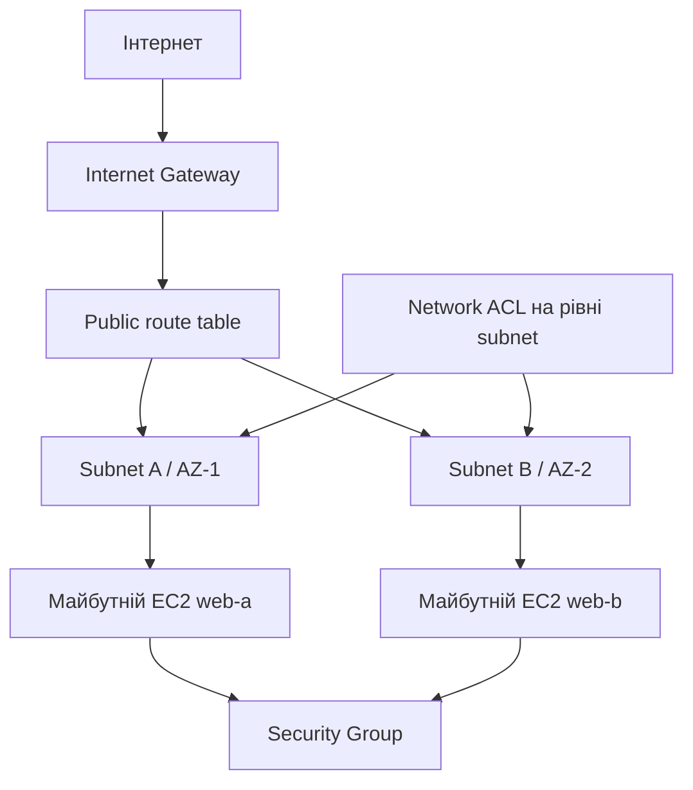

# Практичне заняття 1. Проєктування та реалізація мережі
### Змістовний модуль 1 · Технології хмарних обчислень

> **Тип заняття:** практичне заняття.
>
> Тут немає покрокового рецепта команд. Курсант самостійно реалізує мережеву частину Cloud Operations Portal, спираючись на демонстрацію з [Lesson1_2](../Lesson1_2/README.md). Викладач консультує та перевіряє контрольні точки.

## Мета

Створити мережеву основу, яку без повторного створення VPC використають EC2, ALB і наступні компоненти порталу.

## Вихідні обмеження

- регіон: доступний регіон AWS Academy;
- VPC CIDR: `10.0.0.0/16`;
- subnet A: `10.0.1.0/24`;
- subnet B: `10.0.2.0/24`;
- subnet мають бути в різних Availability Zones;
- усі ресурси мають містити теги `Project=cloud-operations-portal` і `Owner=<ваше ім'я>`;
- у GitHub не публікуються секрети та реальні ключі доступу.

## Архітектурне завдання

Перед роботою намалюйте власну схему й позначте напрямок пакетів:

На схемі окремо підпишіть:

- межу VPC;
- адресний простір кожної subnet;
- маршрут `0.0.0.0/0`;
- правила для HTTP і адміністративного доступу;
- компоненти, які будуть додані на Lesson1_6.

## Завдання

1. Створіть VPC за власним планом адресації.
2. Створіть дві subnet у різних AZ.
3. Підключіть Internet Gateway.
4. Створіть route table і прив'яжіть її до обох subnet.
5. Налаштуйте Security Group для майбутнього вебсервера.
6. Налаштуйте Network ACL так, щоб не блокувати потрібні відповіді TCP.
7. Перевірте кожну залежність і внесіть ID ресурсів до локального файлу стану.
8. Оформіть результат у GitHub без реальних секретів.

## Артефакти

Після роботи в репозиторії мають бути:

- `docs/network-architecture.md` зі схемою;
- `docs/network-inventory.md` з VPC ID, subnet ID, AZ, CIDR і призначенням;
- `state/environment.example.env` із назвами змінних без реальних значень;
- таблиця дозволених портів;
- короткий опис різниці Security Group і Network ACL;
- checklist перевірки перед Lesson1_4.

## Критерії готовності

| Перевірка | Очікуваний результат |
|---|---|
| VPC | CIDR відповідає затвердженій схемі |
| Availability Zones | subnet розміщені у двох різних AZ |
| Маршрути | обидві subnet мають потрібний маршрут |
| Доступ | HTTP дозволений лише запланованим правилом |
| Теги | ресурси можна знайти за Project і Owner |
| Передача стану | наступне заняття не створює нову VPC |
| Документація | схема відповідає фактичним ресурсам |

## Самоперевірка

Поясніть викладачу:

1. чому маршрут і Security Group вирішують різні задачі;
2. чому subnet у різних AZ не означають автоматичне балансування;
3. що станеться, якщо NACL дозволить вхідний HTTP, але заблокує ephemeral ports;
4. які ресурси потрібно видаляти першими, а які останніми.

## Межі роботи

На цьому занятті не потрібно створювати ALB, S3, CloudFront або Lambda. Практика завершується мережею та її документацією.
