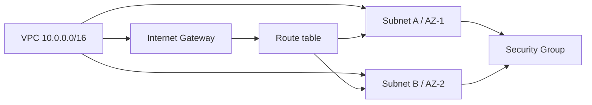

# Групове заняття 1. Створення мережевої основи
### Змістовний модуль 1 · Технології хмарних обчислень

> **Тип заняття:** групове заняття.
>
> Викладач виконує команди в AWS CloudShell і пояснює кожен параметр. Курсант спостерігає, ставить питання та записує алгоритм. Самостійне створення мережі є завданням практичного заняття 1.4.

## Мета демонстрації

Показати, як створюється мережа для майбутніх EC2 і ALB:



## 1. Підготовка CloudShell

```bash
# Перевіряємо, що AWS CLI доступний у CloudShell.
aws --version

# Перевіряємо тимчасову роль і акаунт Learner Lab.
aws sts get-caller-identity

# Встановлюємо регіон, спільний для всіх наступних ресурсів.
export AWS_REGION="${AWS_REGION:-us-east-1}"
aws configure set region "$AWS_REGION"
```

## 2. VPC

```bash
# Створюємо адресний простір проєкту.
# /16 залишає місце для додаткових subnet у наступних модулях.
VPC_ID=$(aws ec2 create-vpc \
  --cidr-block 10.0.0.0/16 \
  --tag-specifications 'ResourceType=vpc,Tags=[{Key=Name,Value=cloud-portal-vpc}]' \
  --query 'Vpc.VpcId' \
  --output text)

# Вмикаємо DNS hostnames, щоб public EC2 міг отримати DNS-ім'я.
aws ec2 modify-vpc-attribute \
  --vpc-id "$VPC_ID" \
  --enable-dns-hostnames '{"Value":true}'

echo "VPC: $VPC_ID"
```

## 3. Internet Gateway

```bash
# Створюємо компонент, який може бути target для зовнішнього маршруту.
IGW_ID=$(aws ec2 create-internet-gateway \
  --tag-specifications 'ResourceType=internet-gateway,Tags=[{Key=Name,Value=cloud-portal-igw}]' \
  --query 'InternetGateway.InternetGatewayId' \
  --output text)

# Прикріплюємо IGW до конкретної VPC.
aws ec2 attach-internet-gateway \
  --internet-gateway-id "$IGW_ID" \
  --vpc-id "$VPC_ID"
```

## 4. Дві subnet

```bash
# Обираємо дві доступні Availability Zones поточного регіону.
AZS=($(aws ec2 describe-availability-zones \
  --state available \
  --query 'AvailabilityZones[0:2].ZoneName' \
  --output text))

# Перша subnet має власний /24-блок і першу AZ.
SUBNET_A_ID=$(aws ec2 create-subnet \
  --vpc-id "$VPC_ID" \
  --cidr-block 10.0.1.0/24 \
  --availability-zone "${AZS[0]}" \
  --tag-specifications 'ResourceType=subnet,Tags=[{Key=Name,Value=cloud-portal-subnet-a}]' \
  --query 'Subnet.SubnetId' \
  --output text)

# Друга subnet має інший CIDR і другу AZ.
SUBNET_B_ID=$(aws ec2 create-subnet \
  --vpc-id "$VPC_ID" \
  --cidr-block 10.0.2.0/24 \
  --availability-zone "${AZS[1]}" \
  --tag-specifications 'ResourceType=subnet,Tags=[{Key=Name,Value=cloud-portal-subnet-b}]' \
  --query 'Subnet.SubnetId' \
  --output text)

echo "A: $SUBNET_A_ID / ${AZS[0]}"
echo "B: $SUBNET_B_ID / ${AZS[1]}"
```

## 5. Route table

```bash
# Створюємо таблицю маршрутів усередині VPC.
RT_ID=$(aws ec2 create-route-table \
  --vpc-id "$VPC_ID" \
  --tag-specifications 'ResourceType=route-table,Tags=[{Key=Name,Value=cloud-portal-public-rt}]' \
  --query 'RouteTable.RouteTableId' \
  --output text)

# Весь зовнішній IPv4-трафік направляємо до Internet Gateway.
aws ec2 create-route \
  --route-table-id "$RT_ID" \
  --destination-cidr-block 0.0.0.0/0 \
  --gateway-id "$IGW_ID"

# Прив'язуємо таблицю до обох subnet.
aws ec2 associate-route-table --route-table-id "$RT_ID" --subnet-id "$SUBNET_A_ID"
aws ec2 associate-route-table --route-table-id "$RT_ID" --subnet-id "$SUBNET_B_ID"
```

## 6. Security Group

```bash
# Security Group є stateful firewall на рівні мережевого інтерфейсу EC2.
SG_ID=$(aws ec2 create-security-group \
  --group-name cloud-portal-sg \
  --description 'HTTP access for Cloud Operations Portal' \
  --vpc-id "$VPC_ID" \
  --query 'GroupId' \
  --output text)

# Для демонстрації відкриваємо HTTP.
# SSH у навчальному проєкті потрібно обмежувати, а не відкривати всьому інтернету.
aws ec2 authorize-security-group-ingress \
  --group-id "$SG_ID" \
  --protocol tcp \
  --port 80 \
  --cidr 0.0.0.0/0
```

## 7. Перевірка викладача

```bash
# Порівнюємо фактичні subnet із запланованими CIDR і AZ.
aws ec2 describe-subnets \
  --filters "Name=vpc-id,Values=$VPC_ID" \
  --query 'Subnets[].{Id:SubnetId,CIDR:CidrBlock,AZ:AvailabilityZone}' \
  --output table

# Переконуємося, що default route має Internet Gateway як target.
aws ec2 describe-route-tables \
  --route-table-ids "$RT_ID" \
  --query 'RouteTables[0].Routes[].{Destination:DestinationCidrBlock,Gateway:GatewayId,State:State}' \
  --output table
```

## Питання під час демонстрації

1. Який ресурс визначає адресний простір?
2. Чому дві subnet мають різні CIDR?
3. Яка команда прив'язує route table до subnet?
4. На якому рівні працює Security Group?
5. Чому правила NACL і Security Group не є взаємозамінними?

## Межі заняття

Викладач не виконує фінальне створення EC2, ALB, S3, CloudFront або Lambda. Курсант переносить алгоритм побудови мережі на практичне заняття 1.4.
