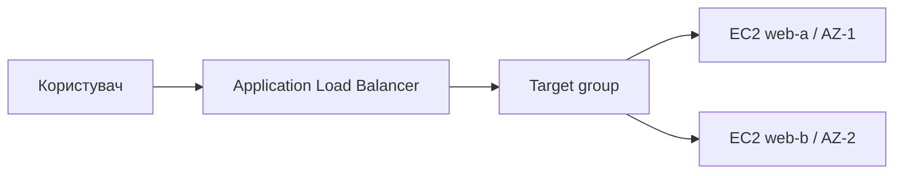
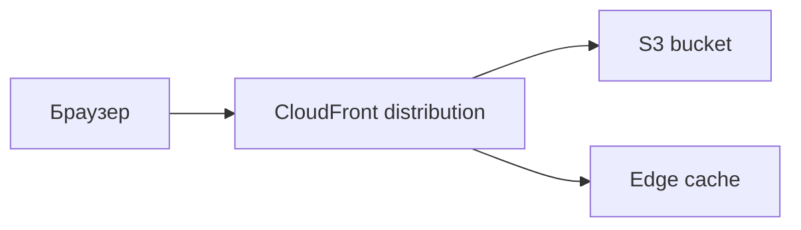
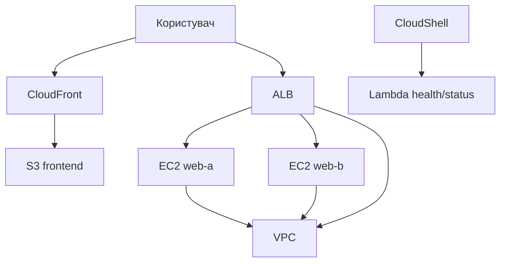

# Лекція 2. Обчислення, сховище, доставка і serverless
### Змістовний модуль 1 · Технології хмарних обчислень

> **Тип заняття:** лекція.
>
> Команди AWS на цьому занятті не виконуються. Лекція пояснює роль сервісів, межі їх застосування та архітектуру наступних практичних етапів.

## Мета

Курсант розуміє, як поверх підготовленої VPC будуються обчислювальний шар, статичний frontend і serverless-компонент.

## 1. EC2 і балансування

EC2 є віртуальним сервером із власною ОС, диском, мережевим інтерфейсом і життєвим циклом. User data допомагає виконати початкову конфігурацію під час запуску.

Application Load Balancer приймає HTTP/HTTPS-запити, перевіряє стан target group і направляє запит до здорової цілі.

## 2. S3 і CloudFront

S3 зберігає статичні об'єкти, а не запускає процеси. CloudFront кешує об'єкти на edge locations і звертається до origin, коли потрібної версії немає в кеші.

У навчальному середовищі можна показати публічний endpoint, але production-архітектура має використовувати приватний bucket і Origin Access Control.

## 3. Lambda

Lambda запускає короткий обробник за викликом або подією. AWS керує операційним середовищем, а користувач визначає код, runtime, timeout, пам'ять і IAM execution role.

| Характеристика | EC2 | Lambda |
|---|---|---|
| Життєвий цикл | Постійний інстанс | Виклик функції |
| Контроль ОС | Високий | Відсутній |
| Типові задачі | Вебсервер, довгий процес | Подія, короткий API-запит |
| Оплата | Час роботи інстансу | Виклики та тривалість |

## 4. Фінальна архітектура модуля

## Питання лекції

1. Чому ALB не замінює Security Group?
2. Чому S3 і EC2 мають різну модель відповідальності?
3. Чому CloudFront може віддати застарілий об'єкт?
4. Які властивості задачі роблять її придатною для Lambda?
5. Які компоненти залишаються залежними від VPC, а які можуть працювати окремо?

## Результат

До наступного групового заняття курсант має підготувати оновлену архітектурну схему, де видно EC2, ALB, S3, CloudFront і Lambda. Команди, що реалізують цю схему, демонструються окремо на Lesson1_5.
