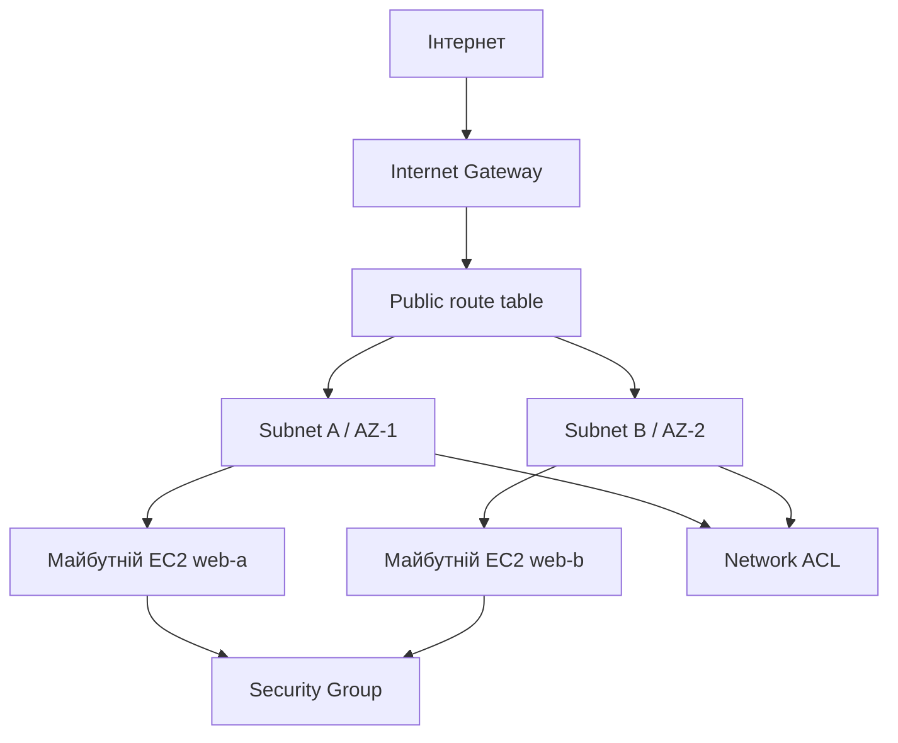

# Практичне заняття 1. Проєктування та реалізація VPC
### Змістовний модуль 1 · Технології хмарних обчислень

> **Тип заняття:** практичне заняття.
>
> Курсант самостійно створює мережеву основу Cloud Operations Portal за матеріалами лекцій 1.1–1.2 і демонстрацією 1.3. Цей README містить завдання, обмеження, архітектурні схеми та критерії готовності, але не покроковий рецепт команд.

## Мета

Створити реальну VPC, яку використають EC2, ALB і наступні компоненти продукту без повторного створення мережі.

## Вхідні умови

- AWS Academy Learner Lab;
- один обраний регіон;
- VPC CIDR `10.0.0.0/16`;
- subnet A `10.0.1.0/24`;
- subnet B `10.0.2.0/24`;
- subnet A і B у різних Availability Zones;
- імена ресурсів мають містити `cloud-portal`;
- секрети та ключі доступу не зберігаються в GitHub.

## Архітектурне завдання

До початку роботи створіть власну схему мережі:



На схемі обов'язково позначте межу VPC, CIDR, AZ, маршрут `0.0.0.0/0`, правила HTTP і майбутній шлях до ALB.

## Завдання практики

1. Реалізуйте VPC за затвердженим CIDR-планом.
2. Створіть і назвіть дві subnet у різних AZ.
3. Підключіть Internet Gateway.
4. Створіть route table та асоціюйте її з обома subnet.
5. Створіть Security Group для майбутнього HTTP-сервісу.
6. Налаштуйте Network ACL і врахуйте зворотні TCP-порти.
7. Перевірте фактичні CIDR, AZ, маршрути та правила.
8. Збережіть стан ресурсів для групового заняття 1.5.

## Потрібні артефакти

```text
docs/
  network-architecture.md
  network-inventory.md
  network-security.md
state/
  environment.example.env
```

`network-inventory.md` має містити для кожного ресурсу тип, назву, ID, CIDR або порт, AZ, призначення та залежності. `environment.example.env` містить лише назви змінних, наприклад `VPC_ID=`, без реальних секретів.

### Зразки оформлення

Зразки показують структуру документів і формат заповнення. Вони не замінюють власні артефакти курсанта: умовні ID, CIDR, AZ і правила потрібно замінити фактичними значеннями створеного середовища.

- [Приклад мережевої архітектури](examples/network-architecture.md)
- [Приклад інвентарю ресурсів](examples/network-inventory.md)
- [Приклад правил безпеки](examples/network-security.md)
- [Шаблон змінних середовища](examples/environment.example.env)

## Таблиця правил

Складіть і додайте до `network-security.md` таблицю:

| Рівень | Напрямок | Протокол | Порт | Джерело або призначення | Причина |
|---|---|---|---:|---|---|
| Security Group | Inbound | TCP | 80 | `0.0.0.0/0` для demo | HTTP до ALB або EC2 |
| Security Group | Inbound | TCP | 22 | Обмежена IP-адреса | Адміністрування |
| Network ACL | Inbound | TCP | 1024–65535 | Зовнішні клієнти | Відповіді TCP |

Таблиця є проєктним документом: фактичні правила можуть бути вужчими, якщо це дозволяє сценарій.

## Критерії готовності

| Перевірка | Очікування |
|---|---|
| VPC | `10.0.0.0/16`, правильні теги |
| Subnet | Дві subnet, різні AZ, CIDR без перетинів |
| Internet Gateway | Прикріплений до потрібної VPC |
| Route table | Обидві subnet мають необхідну асоціацію |
| Security Group | Дозволені лише обґрунтовані порти |
| Network ACL | Не блокує заплановані відповіді |
| Передача стану | IDs доступні для Lesson1_5 |
| Документація | Схема відповідає фактичній конфігурації |

## Захист практичної роботи

Курсант демонструє схему та відповідає:

1. Як пакет потрапляє з інтернету до subnet?
2. Яку роль має Internet Gateway, а яку route table?
3. Чим NACL відрізняється від Security Group?
4. Чому майбутній ALB потребуватиме дві subnet?
5. Які ресурси потрібно видаляти під час cleanup?

## Межі практики

Практика завершується мережевим фундаментом. EC2, ALB, S3, CloudFront і Lambda додаються на наступних заняттях, використовуючи цю саму VPC.
