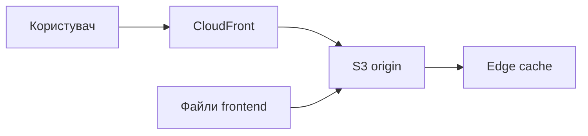

# S3 і CloudFront: зберігання та доставка контенту
### Змістовний модуль 1 · Заняття 4

> **Місце в модулі:** етап 3, статичний frontend Cloud Operations Portal.
>
> **Попередня умова:** завершені [Lesson1_2](../Lesson1_2/README.md) і [Lesson1_3](../Lesson1_3/README.md). Використовуйте наявний проєкт і його AWS-регіон.
>
> **Формат:** на лекції вивчаємо об'єктне сховище та CDN; на груповому занятті викладач демонструє команди; на практичному курсант проєктує структуру frontend і самостійно розгортає S3 та CloudFront.

## Результат

Frontend порталу зберігається в S3 і доступний користувачу через CloudFront. Курсант може пояснити різницю між origin, edge location, кешем і прямим доступом до S3.



## 1. Лекція

### S3

S3 є об'єктним сховищем. Об'єкт складається з ключа, вмісту та метаданих і зберігається в bucket. S3 не є файловою системою EC2 і не потребує керування віртуальною машиною.

### CloudFront

CloudFront розміщує кешовані копії об'єктів у edge locations. Користувач звертається до доменного імені CloudFront, а distribution отримує об'єкт з origin, якщо його немає в кеші.

| Поняття | Значення |
|---|---|
| Bucket | Логічний контейнер S3 |
| Object key | Унікальний шлях об'єкта в bucket |
| Origin | Джерело контенту для CloudFront |
| Edge location | Точка присутності CDN |
| Cache behavior | Правила кешування й маршрутизації |
| Invalidation | Примусове видалення об'єкта з кешу |

Для production краще залишати bucket приватним і використовувати CloudFront Origin Access Control. Публічний S3 website endpoint у цьому курсі допустимий лише як навчальна демонстрація.

## 2. Групове заняття: демонстрація викладача

```bash
export AWS_REGION=${AWS_REGION:-us-east-1}
export LAB_ID="$(date +%s)"
export BUCKET_NAME="cloud-portal-${LAB_ID}"

aws s3api create-bucket --bucket "$BUCKET_NAME" --region "$AWS_REGION" \
  $( [[ "$AWS_REGION" != "us-east-1" ]] && echo "--create-bucket-configuration LocationConstraint=$AWS_REGION" )
aws s3 cp ./site/ "s3://$BUCKET_NAME/" --recursive
aws s3api head-object --bucket "$BUCKET_NAME" --key index.html
```

Викладач показує створення CloudFront distribution, статус `InProgress` і перехід до `Deployed`. Також демонструється різниця між першим запитом до origin і наступним запитом із кешу.

```bash
aws cloudfront list-distributions \
  --query 'DistributionList.Items[].{Id:Id,Status:Status,Domain:DomainName}' \
  --output table
```

Під час демонстрації викладач змінює `index.html`, повторно завантажує файл і показує, чому користувач може ще бачити стару версію.

## 3. Практичне заняття

### Завдання

Додайте до власного Cloud Operations Portal статичний frontend:

1. підготуйте `index.html`, CSS і, за потреби, зображення;
2. визначте структуру ключів у S3;
3. створіть bucket з тегами проєкту;
4. завантажте frontend;
5. підключіть CloudFront до S3;
6. перевірте доступ через CloudFront;
7. оновіть сторінку і дослідіть кешування.

Не копіюйте значення `BUCKET_NAME` або distribution ID з демонстрації викладача.

### Архітектурне завдання

Намалюйте два шляхи запиту:

- прямий доступ до S3;
- доступ користувача через CloudFront.

На схемі позначте, де відбуваються автентифікація, кешування, доставка і контроль доступу.

## 4. Самопідготовка

1. Поясніть, чому публічний bucket є ризиком.
2. Порівняйте S3 website endpoint і S3 REST endpoint.
3. З'ясуйте, коли потрібна CloudFront invalidation.
4. Запропонуйте політику кешування для HTML, CSS, JavaScript і зображень.
5. Додайте в документацію процедуру безпечного видалення bucket.

## Контрольна точка

Етап завершено, якщо:

- frontend відкривається через CloudFront;
- у документації є схема шляху запиту;
- зафіксовані bucket і distribution без публікації чутливих даних;
- курсант пояснює, звідки береться стара версія об'єкта;
- cleanup не залишає bucket з об'єктами.
