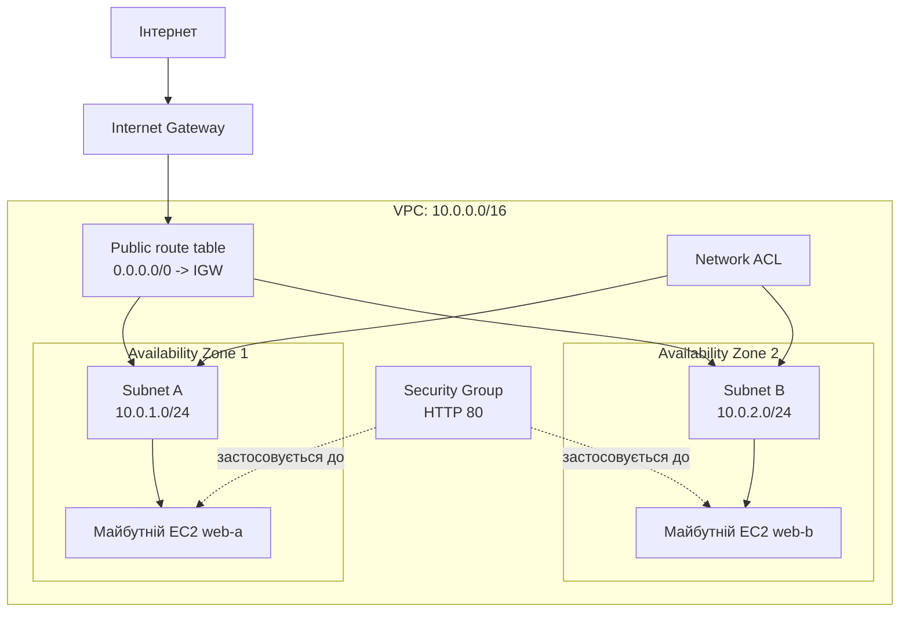

# Приклад: мережева архітектура

> Це навчальний зразок оформлення. Значення ресурсів ідентифіковані як умовні та не є результатом роботи курсанта.

## Схема

## Опис компонентів

| Компонент | CIDR або порт | Призначення |
|---|---|---|
| VPC | `10.0.0.0/16` | Адресний простір проєкту |
| Subnet A | `10.0.1.0/24`, AZ-1 | Майбутній web-вузол A |
| Subnet B | `10.0.2.0/24`, AZ-2 | Майбутній web-вузол B |
| Route table | `0.0.0.0/0` | Маршрут до Internet Gateway |
| Security Group | TCP `80` | Доступ до HTTP-сервісу |
| Network ACL | За таблицею правил | Контроль трафіку на рівні subnet |

## Потік трафіку

1. Пакет з інтернету потрапляє до Internet Gateway.
2. Route table визначає маршрут до потрібної subnet.
3. Network ACL перевіряє трафік на рівні subnet.
4. Security Group перевіряє доступ до мережевого інтерфейсу EC2.
5. Після додавання ALB він стане точкою входу для HTTP-запитів.
