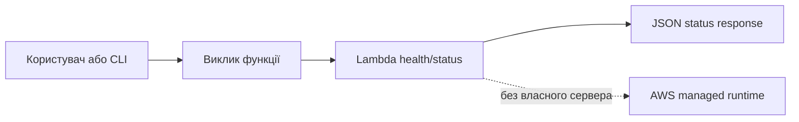

# AWS Lambda: serverless-компонент порталу
### Змістовний модуль 1 · Заняття 5

> **Місце в модулі:** етап 4, health/status-компонент Cloud Operations Portal.
>
> **Попередня умова:** завершені [Lesson1_2](../Lesson1_2/README.md), [Lesson1_3](../Lesson1_3/README.md) і [Lesson1_4](../Lesson1_4/README.md).
>
> **Формат:** лекція пояснює serverless-модель; на груповому занятті викладач показує створення та виклик Lambda; на практичному курсант самостійно формує контракт функції, реалізує її та документує вибір моделі виконання.

## Результат

У проєкті працює Lambda-функція `health/status`, яка повертає JSON-стан середовища. Курсант може порівняти Lambda з постійним процесом EC2 і пояснити роль IAM execution role.



## 1. Лекція

Lambda запускає код у відповідь на виклик або подію. Курсант відповідає за код, конфігурацію та права функції, але не керує операційною системою чи процесом вебсервера.

| EC2 | Lambda |
|---|---|
| Процес працює доти, доки працює інстанс | Код запускається на виклик |
| Потрібні патчі ОС і контроль сервера | ОС і runtime керує AWS |
| Підходить для довгих або постійних процесів | Підходить для коротких подійних задач |
| Оплата за час роботи інстансу | Оплата за виклики та тривалість виконання |

Важливі поняття: runtime, handler, event, context, cold start, timeout, memory, execution role і логування в CloudWatch Logs.

## 2. Групове заняття: демонстрація викладача

Викладач показує мінімальну функцію, її пакування та синхронний виклик через CLI. Код демонстрації не є готовим рішенням для самостійної роботи.

```bash
cat > /tmp/handler.py <<'EOF'
import json

def lambda_handler(event, context):
    return {
        "statusCode": 200,
        "headers": {"Content-Type": "application/json"},
        "body": json.dumps({"service": "cloud-operations-portal", "status": "ok"})
    }
EOF

cd /tmp
zip -q lambda-demo.zip handler.py
aws lambda invoke \
  --function-name "$FUNCTION_NAME" \
  --payload '{"source":"group-demo"}' \
  /tmp/response.json
cat /tmp/response.json
```

Викладач також показує `aws lambda get-function-configuration`, перегляд логів і помилку недостатніх IAM-дозволів.

## 3. Практичне заняття

### Завдання

Реалізуйте функцію `health/status` для власного порталу. Вона має повертати щонайменше:

```json
{
  "service": "cloud-operations-portal",
  "status": "ok",
  "environment": "academy",
  "version": "1.0"
}
```

Курсант самостійно визначає:

- назву функції;
- runtime;
- формат event і response;
- спосіб пакування;
- необхідні IAM-дозволи;
- критерії успішності та помилки.

### Архітектурне завдання

Покажіть на схемі два незалежні шляхи:

1. статичний frontend через CloudFront і S3;
2. виклик Lambda через CLI або майбутній API endpoint.

Поясніть, чому Lambda не повинна зберігати постійний стан у локальній файловій системі.

## 4. Самопідготовка

1. Дослідіть cold start і його вплив на перший виклик.
2. Порівняйте timeout, memory та ephemeral storage Lambda.
3. Перевірте, які логи створюються у CloudWatch Logs.
4. Опишіть, коли для цього компонента краще ECS або EC2.
5. Підготуйте негативний тест: неправильна подія або контрольована помилка.

## Контрольна точка

Етап завершено, якщо:

- Lambda викликається через CLI;
- відповідь має документований JSON-формат;
- IAM-дозволи обмежені потребами функції;
- є позитивний і негативний тест;
- схема порталу містить новий serverless-компонент.
