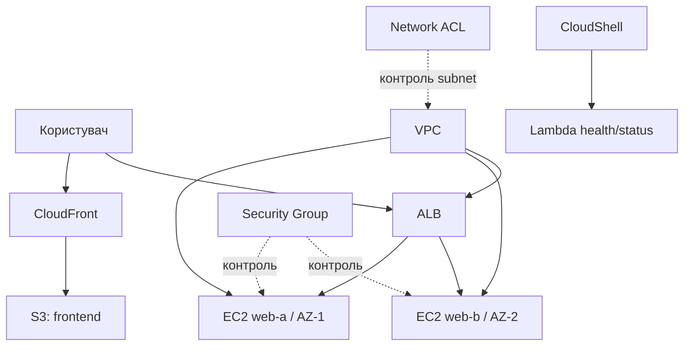

# Практичне заняття 2. Фінальна збірка, аудит і захист
### Змістовний модуль 1 · Технології хмарних обчислень

> **Тип заняття:** практичне заняття.
>
> Курсант самостійно завершує Cloud Operations Portal на основі попередніх артефактів. Тут немає покрокового переліку команд: завдання полягає у виборі рішень, реалізації, перевірці та документуванні результату.

## Мета

Зібрати завершене хмарне середовище, довести його працездатність, виконати аудит безпеки та підготувати фінальний захист.

## Фінальна архітектура



## Завдання

### 1. Завершити продукт

- продовжити VPC з Lesson1_4;
- розгорнути два EC2 у різних AZ;
- підключити їх до ALB;
- розмістити frontend у S3;
- додати CloudFront;
- створити Lambda `health/status`;
- додати теги до всіх ресурсів.

### 2. Довести працездатність

Підготуйте таблицю тестів:

| Тест | Передумова | Очікуваний результат | Фактичний результат |
|---|---|---|---|
| Frontend | CloudFront deployed | Відкривається сторінка | Заповнює курсант |
| ALB | Дві healthy targets | Запит отримує відповідь | Заповнює курсант |
| Lambda | Функція існує | JSON зі статусом `ok` | Заповнює курсант |
| Відмова EC2 | Один вузол зупинено | ALB лишається доступним | Заповнює курсант |
| Cleanup | Ресурси відомі | Платні ресурси видалені | Заповнює курсант |

### 3. Виконати аудит

Перевірте та задокументуйте:

- відкриті порти Security Group;
- правила Network ACL і зворотний TCP-трафік;
- public IP та SSH-доступ;
- доступність S3 bucket;
- IAM execution role Lambda;
- стан target group;
- ресурси, що можуть генерувати витрати.

## Артефакти GitHub

Створіть або оновіть:

```text
docs/
  architecture-final.md
  resource-inventory.md
  security-checklist.md
  test-results.md
  cleanup-checklist.md
state/
  environment.example.env
```

`resource-inventory.md` має містити назву ресурсу, тип, ID, регіон, AZ, призначення та залежності. Реальні секрети, access keys і приватні дані не додаються до GitHub.

## Критерії оцінювання

| Критерій | Частка |
|---|---:|
| Працездатність Cloud Operations Portal | 30% |
| Відповідність фактичних ресурсів схемі | 20% |
| Тест відмови та перевірка health status | 15% |
| Аудит безпеки | 20% |
| Документація і cleanup | 15% |

## Фінальний захист

За 5–7 хвилин курсант має:

1. показати фінальну архітектурну схему;
2. пояснити шлях статичного та динамічного запиту;
3. продемонструвати ALB, CloudFront і Lambda;
4. показати результат контрольованої відмови EC2;
5. назвати два ризики навчальної конфігурації;
6. пояснити порядок видалення ресурсів.

## Умова завершення

Практика завершена, якщо продукт працює, документація відповідає фактичним ресурсам, результати тестів зафіксовані, а середовище або передане в наступний модуль, або очищене без залишених платних ресурсів.
