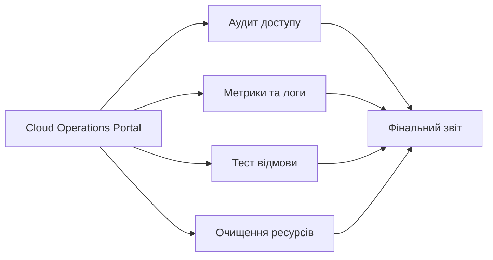

# Безпека, спостережуваність і фінальний захист
### Змістовний модуль 1 · Заняття 6

> **Місце в модулі:** етап 5, завершення Cloud Operations Portal.
>
> **Попередня умова:** завершені [Lesson1_2](../Lesson1_2/README.md), [Lesson1_3](../Lesson1_3/README.md), [Lesson1_4](../Lesson1_4/README.md) і [Lesson1_5](../Lesson1_5/README.md).
>
> **Формат:** лекція систематизує безпеку, метрики, витрати та cleanup; на груповому занятті викладач показує аудит і типові відмови; на практичному курсант проводить власну перевірку, виправляє ризики і захищає готове середовище.

## Результат

Курсант може не лише запустити портал, а й довести його працездатність, пояснити межі доступу, побачити відмову компонента та безпечно видалити ресурси.



## 1. Лекція

### Shared responsibility і найменші привілеї

Перевіряйте не лише, чи працює ресурс, а й хто має до нього доступ. Відкритий порт, публічний bucket, широкі IAM-права та незахищені ключі є окремими ризиками.

| Об'єкт | Що перевірити |
|---|---|
| Security Group | Лише потрібні порти та джерела трафіку |
| Network ACL | Правила subnet і зворотний TCP-трафік |
| S3 | Public Access Block, bucket policy, зайві об'єкти |
| Lambda | Execution role і доступ до логів |
| EC2 | SSH, user data, стан інстансу, public IP |
| CloudFront | Origin, HTTPS policy, кешування |

### Спостережуваність

Мінімальна перевірка порталу має містити стан EC2, health status target group, HTTP-відповідь ALB, доступність CloudFront, виклик Lambda та перегляд логів. Метрика без порогу й дії у відповідь на проблему не є повною перевіркою.

### Вартість і cleanup

У навчальному середовищі потрібно особливо перевіряти EC2, Elastic IP, Load Balancer, CloudFront distribution, S3 objects і CloudWatch Logs. Ресурси видаляються у зворотному порядку залежностей.

## 2. Групове заняття: демонстрація викладача

Викладач показує аудит без зміни студентського середовища або на окремому demo-проєкті:

```bash
aws ec2 describe-security-groups --group-ids "$SG_ID" --output table
aws ec2 describe-network-acls --filters "Name=vpc-id,Values=$VPC_ID" --output table
aws elbv2 describe-target-health --target-group-arn "$TG_ARN" --output table
aws cloudwatch list-metrics --namespace AWS/EC2 --output table
aws lambda invoke --function-name "$FUNCTION_NAME" /tmp/final-status.json
cat /tmp/final-status.json
```

Далі викладач демонструє одну контрольовану відмову: зупиняє один EC2, перевіряє стан target group і показує, що ALB продовжує направляти запити до здорової цілі.

## 3. Практичне заняття

### Завдання фінального аудиту

1. Перевірте, що всі ресурси належать одному проєкту за тегами.
2. Складіть інвентар ресурсів з ID, регіоном, AZ, призначенням і станом.
3. Перевірте відкриті порти та джерела доступу.
4. Перевірте health status EC2 і ALB.
5. Викличте Lambda та збережіть результат тесту.
6. Змініть або зупиніть один EC2 і доведіть роботу відмовостійкої частини.
7. Виконайте cleanup і перевірте, що платні ресурси не залишилися.

### Фінальна схема

Оновіть одну схему, на якій видно:

- шлях frontend: користувач -> CloudFront -> S3;
- шлях HTTP: користувач -> ALB -> EC2;
- шлях serverless: CLI або подія -> Lambda;
- VPC, дві subnet і Availability Zones;
- межі Security Group та Network ACL.

## 4. Самопідготовка

Підготуйте фінальний звіт у GitHub:

- `architecture-final.md`;
- `resource-inventory.md`;
- `security-checklist.md`;
- `test-results.md`;
- `cleanup-checklist.md`.

У звіті дайте відповіді:

1. Який компонент буде недоступний першим при відмові кожної AZ?
2. Які правила доступу потрібно змінити перед production?
3. Які ресурси можуть генерувати витрати після завершення тесту?
4. Чим ця навчальна архітектура відрізняється від production-варіанта?

## 5. Фінальний захист

Під час захисту курсант за 5–7 хвилин:

1. пояснює архітектуру і шлях запиту;
2. демонструє frontend через CloudFront;
3. демонструє відповідь ALB та Lambda;
4. показує результат тесту відмови;
5. називає основні ризики доступу;
6. пояснює порядок cleanup.

## Критерії оцінювання

| Критерій | Частка |
|---|---:|
| Працездатність і демонстрація продукту | 30% |
| Архітектура та обґрунтування рішень | 20% |
| Безпека і контроль доступу | 20% |
| Тестування відмови та спостережуваність | 15% |
| Документація і cleanup | 15% |

## Контрольна точка

Модуль завершено, якщо Cloud Operations Portal продемонстровано, фінальна схема та звіт збережені в GitHub, а створені AWS-ресурси або передані в наступний модуль зафіксованим способом, або повністю видалені.
