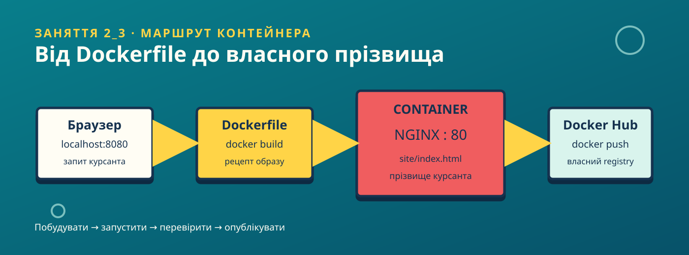

# 🧽 Технології контейнеризації
### Змістовний модуль 2 · Заняття 3 · Практичне

> **Тема:** Підготовка та розгортання першого персонального контейнера
> **Тривалість:** 120 хвилин
> **Результат:** власний Docker image із сайтом у мультяшному підводному стилі та ідентифікацією курсанта



> Банер і сайт використовують оригінальну графічну айдентику: жовтий, бірюзовий, кораловий кольори, бульбашки та морські мотиви. Офіційні зображення персонажів або логотипи не потрібні.

## Навчальні питання

1. Встановлення та перевірка Docker.
2. Створення `Dockerfile`.
3. Створення Docker image.
4. Розгортання контейнера.
5. Збереження образу у власному репозиторії Docker Hub.

## Мета та результат

Після роботи курсант уміє:

- перевірити Docker Engine або Docker Desktop;
- пояснити зв'язок `Dockerfile → image → container → browser`;
- власноруч змінити прізвище у файлі сайту;
- зібрати образ, запустити контейнер і перевірити port mapping;
- переглянути логи, зупинити та видалити контейнер;
- опублікувати образ у власному Docker Hub repository.

## 1. Підготовка

Потрібні Docker Desktop для macOS/Windows або Docker Engine для Linux. Перевірте середовище:

```bash
docker version
docker run --rm hello-world
```

Якщо команда не виконується, спочатку запустіть Docker Desktop або встановіть Docker Engine за офіційною інструкцією для вашої ОС.

## 2. Отримання стартових файлів

У терміналі перейдіть до кореня цього репозиторію:

```bash
cd tasp243/Lesson2_3
```

Структура практичної роботи:

```text
Lesson2_3/
├── Dockerfile
├── README.md
├── images/
│   └── architecture-banner.svg
└── site/
    └── index.html
```

## 3. Персоналізація курсанта

Відкрийте `site/index.html` і знайдіть блок:

```js
const cadetSurname = "ВПИШІТЬ_ПРІЗВИЩЕ";
```

Замініть значення на власне прізвище, наприклад:

```js
const cadetSurname = "ШЕВЧЕНКО";
```

Це навмисно зроблено вручну: викладач перевіряє, чи кожен курсант зібрав власний образ, а не просто запустив готовий контейнер. Не використовуйте секрети, номери документів або інші приватні дані.

## 4. Розбір Dockerfile

```dockerfile
FROM nginx:1.27-alpine
LABEL org.opencontainers.image.title="lesson2-3-sponge-web"
LABEL org.opencontainers.image.description="Personalized Docker training website"
COPY site/index.html /usr/share/nginx/html/index.html
EXPOSE 80
```

| Інструкція | Призначення |
|---|---|
| `FROM` | Базовий образ із легким NGINX |
| `LABEL` | Метадані, які видно під час інспекції образу |
| `COPY` | Перенесення сайту у web-root NGINX |
| `EXPOSE` | Документування порту застосунку всередині контейнера |

## 5. Створення образу

Виконайте команду з директорії `Lesson2_3`:

```bash
docker build --tag lesson2-3-web:1.0 .
docker image ls lesson2-3-web
```

Точка в кінці `docker build` означає поточну директорію як build context. Docker прочитає `Dockerfile` і файли, на які він посилається.

## 6. Розгортання контейнера

```bash
docker run --detach \
  --name lesson2-3-web \
  --publish 8080:80 \
  lesson2-3-web:1.0

docker ps
```

Відкрийте [http://localhost:8080](http://localhost:8080). На сторінці повинні бути:

- прізвище саме цього курсанта;
- картка образу `lesson2-3-web`;
- маршрут `localhost:8080`;
- мультяшна підводна айдентика та рухомі бульбашки.

Перевірте контейнер додатковими командами:

```bash
docker logs lesson2-3-web
docker inspect lesson2-3-web
docker exec lesson2-3-web nginx -v
```

Зупинка та очищення після перевірки:

```bash
docker stop lesson2-3-web
docker rm lesson2-3-web
```

## 7. Публікація у Docker Hub

Створіть на [Docker Hub](https://hub.docker.com/) власний repository, наприклад `lesson2-3-web`. Замість `DOCKERHUB_USER` використайте свій username:

```bash
docker login
docker tag lesson2-3-web:1.0 DOCKERHUB_USER/lesson2-3-web:1.0
docker push DOCKERHUB_USER/lesson2-3-web:1.0
```

Перевірка, що колега або викладач може завантажити саме цей image:

```bash
docker pull DOCKERHUB_USER/lesson2-3-web:1.0
docker run --detach --name lesson2-3-check --publish 8081:80 DOCKERHUB_USER/lesson2-3-web:1.0
```

Відкрийте `http://localhost:8081`, потім приберіть перевірочний контейнер:

```bash
docker stop lesson2-3-check
docker rm lesson2-3-check
```

Не публікуйте в README або репозиторії паролі, access token чи інші секрети. Для автоматизації замість пароля використовуйте Docker Hub access token, але вводьте його тільки в терміналі.

## 8. Контрольні питання

1. Чим image відрізняється від container?
2. Чому `COPY` використовує шлях `/usr/share/nginx/html/index.html`?
3. Що означає `8080:80` у `--publish`?
4. Чому зміна прізвища в HTML вимагає нової збірки image?
5. Яку роль виконує Docker Hub у цій роботі?

## Самостійне завдання

1. Замініть прізвище та зберіть образ із тегом `1.0`.
2. Запустіть контейнер на порту `8080`.
3. Зробіть скріншот сторінки, де видно власне прізвище.
4. Опублікуйте образ у Docker Hub.
5. Додайте у звіт username, назву repository, tag і команду запуску.

## Критерії оцінювання

| Критерій | Бали |
|---|---:|
| Docker встановлений і перевірений | 1 |
| Прізвище вручну змінене у `index.html` | 2 |
| Образ успішно зібраний | 2 |
| Контейнер доступний через `localhost:8080` | 2 |
| Пояснено port mapping та архітектуру | 1 |
| Образ опубліковано у Docker Hub | 2 |
| **Разом** | **10** |
