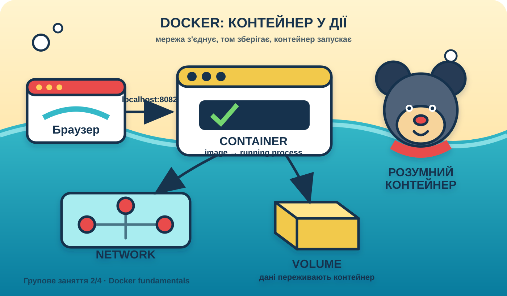

# 🐳 Технології контейнеризації
### Змістовний модуль 2 · Заняття 4 · Групове

> **Тема:** Управління контейнерами, мережеві налаштування та томи у Docker  
> **Тривалість:** 120 хвилин  
> **Формат:** демонстрація викладача, спільний аналіз команд і короткі вправи  
> **Результат:** курсант розуміє життєвий цикл контейнера, уміє під'єднати контейнер до мережі та зберегти дані поза його файловою системою



> Архітектура Docker-контейнера: браузер звертається до опублікованого порту, контейнер працює в мережі, а volume зберігає дані незалежно від його життєвого циклу.

## План заняття

1. Базові поняття та життєвий цикл контейнера.
2. Керування контейнерами: запуск, перегляд, журнали, виконання команд і очищення.
3. Мережеві налаштування Docker.
4. Томи та збереження даних.
5. Самостійна робота: синтаксис YAML і опис сервісів у Docker Compose.

## Мета заняття

Після заняття курсант може:

- відрізнити image, container, network і volume;
- пояснити стани контейнера та його життєвий цикл;
- запускати, зупиняти, перезапускати, досліджувати й видаляти контейнери;
- розрізняти порт контейнера і опублікований порт хоста;
- під'єднувати контейнери до bridge-мережі та звертатися до них за іменем;
- обрати named volume, bind mount або тимчасову файлову систему;
- читати базову YAML-структуру Docker Compose.

## Демонстраційний проєкт заняття

Усі основні команди заняття виконуються для одного локального образу `lesson2-4-demo:1.0`. Перейдіть до каталогу заняття:

```bash
cd Lesson2_4
```

Структура демонстраційного проєкту:

```text
Lesson2_4/
├── Dockerfile
├── images/
│   └── docker-architecture.svg
└── site/
    └── index.html
```

### Dockerfile

```dockerfile
FROM nginx:1.27-alpine

LABEL org.opencontainers.image.title="lesson2-4-docker-mouse"
LABEL org.opencontainers.image.description="Docker container management demonstration website"

COPY site/index.html /usr/share/nginx/html/index.html

EXPOSE 80
```

`FROM` задає легкий базовий образ NGINX, `LABEL` додає метадані, `COPY` переносить сайт у web-root, а `EXPOSE` документує порт застосунку. `EXPOSE` не публікує порт хоста автоматично.

### Збірка та перший запуск

```bash
docker build --tag lesson2-4-demo:1.0 .
docker image inspect lesson2-4-demo:1.0
docker run --detach \
  --name lesson2-4-web \
  --publish 8082:80 \
  lesson2-4-demo:1.0
```

Відкрийте `http://localhost:8082`. На сторінці має відобразитися оригінальна мультяшна мишка та картка запущеного контейнера. У демонстрації змінюйте стан саме цього контейнера, а не випадкового готового `nginx`.

## 1. Базові поняття

Docker складається з кількох пов'язаних об'єктів:

| Об'єкт | Призначення |
|---|---|
| **Image / образ** | Незмінний шаблон із файловою системою, залежностями та метаданими. |
| **Container / контейнер** | Ізольований запущений або зупинений екземпляр образу. |
| **Network / мережа** | Віртуальна мережа, через яку контейнери обмінюються трафіком. |
| **Volume / том** | Сховище, життєвий цикл якого не залежить від контейнера. |
| **Registry** | Сховище образів, наприклад Docker Hub. |

Зв'язок об'єктів можна подати так:

```text
image ──docker run──> container ──під'єднання──> network
                          │
                          └──монтування──> volume
```

Образ є джерелом для створення контейнера, але контейнер не є образом. Зміни у writable layer контейнера зникають після його видалення. Дані, які потрібно зберегти, слід записувати у volume або у директорію хоста через bind mount.

### 1.1. Життєвий цикл

```text
created → running → stopped → removed
             │           │
             └─ restart ─┘
```

- `created` — контейнер створено, але головний процес ще не запущено.
- `running` — головний процес працює.
- `exited` — процес завершився або контейнер зупинено.
- `removed` — метадані контейнера видалено.

Контейнер може завершитися одразу після запуску, якщо його головна команда завершилася. Контейнер живе доти, доки працює його головний процес.

## 2. Керування контейнерами

### 2.1. Перегляд демонстраційного контейнера

Після першого запуску перегляньте стан і конфігурацію контейнера:

```bash
docker ps
docker ps --all
docker inspect lesson2-4-web
```

Параметри `--publish 8082:80` означають: порт `8082` на хості передає HTTP-запити на порт `80` контейнера. Інструкція `EXPOSE` в образі лише документує порт і сама по собі не створює доступ із хоста.

### 2.2. Логи та команди всередині контейнера

```bash
docker logs lesson2-4-web
docker logs --follow lesson2-4-web
docker exec lesson2-4-web nginx -v
docker exec --interactive --tty lesson2-4-web /bin/sh
```

`docker logs` показує stdout і stderr головного процесу. Прапорець `--follow` продовжує стежити за новими повідомленнями. `docker exec` запускає додаткову команду лише поки контейнер працює.

Для виходу з оболонки виконайте `exit`. Не редагуйте файли всередині контейнера як спосіб постійної конфігурації: такі зміни не потраплять до образу та зникнуть після створення нового контейнера.

### 2.3. Керування станом і очищення

```bash
docker pause lesson2-4-web
docker unpause lesson2-4-web
docker restart lesson2-4-web
docker stop lesson2-4-web
docker start lesson2-4-web
```

`docker stop` коректно просить головний процес завершитися, а `docker kill` негайно надсилає сигнал завершення. Контейнер залишаємо до завершення демонстрації, щоб повторно використати його в мережевому прикладі.

Після демонстрації перевірте залишки:

```bash
docker container ls --all
docker image ls
docker system df
```

Не використовуйте `docker system prune -a` без перевірки: команда може видалити всі локальні невикористані образи та контейнери.

## 3. Мережеві налаштування

Docker має вбудовані драйвери мережі. Для навчальних локальних застосунків найчастіше використовується користувацька мережа `bridge`.

| Тип | Коли застосовують |
|---|---|
| `bridge` | Ізольоване спілкування контейнерів на одному Docker host. |
| `host` | Контейнер використовує мережевий простір хоста; ізоляція слабша. |
| `none` | Мережа вимкнена, окрім loopback. |
| `overlay` | Спілкування сервісів між кількома Docker host у Swarm. |

### 3.1. Користувацька bridge-мережа

```bash
docker network create lesson2-4-net
docker network ls
docker network connect lesson2-4-net lesson2-4-web
docker run --rm --interactive --tty --network lesson2-4-net busybox:1.36 \
  wget -qO- http://lesson2-4-web
```

У користувацькій bridge-мережі контейнери можуть знаходити один одного за іменем контейнера через вбудований DNS Docker. Публікація порту потрібна для доступу з хоста, але для спілкування контейнерів в одній мережі вона не обов'язкова.

Перевірка під'єднання та очищення:

```bash
docker network inspect lesson2-4-net
docker network disconnect lesson2-4-net lesson2-4-web
docker network rm lesson2-4-net
```

Не покладайтеся на IP-адресу контейнера: вона може змінитися після пересоздання. Для зв'язку використовуйте ім'я сервісу або контейнера.

### 3.2. Мережа і порт

```text
браузер → localhost:8082 → порт хоста 8082
                         → порт контейнера 80 → NGINX
```

Контейнерний порт і порт хоста — різні поняття. Два контейнери можуть слухати порт `80` усередині кожен, але не можуть одночасно зайняти один порт хоста `8082`.

## 4. Томи та збереження даних

За замовчуванням записи контейнера потрапляють у writable layer. Цей шар прив'язаний до конкретного контейнера, тому для баз даних, завантажень і конфігурацій потрібне зовнішнє сховище.

### 4.1. Named volume

Named volume керується Docker і зручно використовується для даних, які мають пережити пересоздання контейнера.

```bash
docker volume create lesson2-4-data
docker run --detach \
  --name lesson2-4-volume-demo \
  --mount type=volume,source=lesson2-4-data,target=/usr/share/nginx/html \
  lesson2-4-demo:1.0

docker exec lesson2-4-volume-demo ls -la /usr/share/nginx/html
docker inspect lesson2-4-volume-demo
docker rm --force lesson2-4-volume-demo
docker run --rm --mount type=volume,source=lesson2-4-data,target=/data alpine:3.20 \
  ls -la /data
docker volume rm lesson2-4-data
```

### 4.2. Bind mount

Bind mount під'єднує конкретну директорію хоста. Він зручний для розробки, коли зміни локальних файлів мають одразу бути доступні контейнеру.

```bash
mkdir -p ./demo-data
echo "файл із хоста" > ./demo-data/message.txt
docker run --rm \
  --mount type=bind,source="$PWD/demo-data",target=/data,readonly \
  alpine:3.20 cat /data/message.txt
```

Порівняння:

| Варіант | Сильна сторона | Обмеження |
|---|---|---|
| Named volume | Керується Docker, зручний для даних сервісу | Дані не видно у звичайній директорії проєкту |
| Bind mount | Зручний для локальної розробки та спільного доступу до файлів | Залежить від шляху та прав доступу хоста |
| `tmpfs` | Дані зберігаються лише в пам'яті | Дані зникають після зупинки контейнера |

За можливості монтуйте bind mount у режимі `readonly`, якщо контейнеру не потрібно змінювати файли.

## 5. Самостійна робота: синтаксис YAML і Docker Compose

### 5.1. Основи YAML

YAML зберігає дані у вигляді відступів, пар `ключ: значення`, списків і вкладених об'єктів. Для відступів використовуйте пробіли, не табуляцію.

```yaml
name: lesson2-4
services:
  web:
    build: .
    image: lesson2-4-compose:1.0
    ports:
      - "8083:80"
    volumes:
      - web-data:/usr/share/nginx/html:ro
volumes:
  web-data:
```

Правила, які потрібно перевірити:

- ключ і значення розділяються двокрапкою та пробілом;
- вкладеність задається однаковим відступом;
- список починається з `-`;
- рядки з портами краще брати в лапки, щоб YAML не трактував їх як число;
- коментар починається з `#`;
- значення `true`, `false`, `null` мають спеціальне значення;
- назви ключів чутливі до регістру.

### 5.2. Мінімальний `compose.yaml`

Створіть у порожній робочій директорії файл `compose.yaml`:

```yaml
name: lesson2-4

services:
  web:
    build: .
    image: lesson2-4-compose:1.0
    ports:
      - "8083:80"
    networks:
      - frontend
    volumes:
      - web-content:/usr/share/nginx/html:ro

networks:
  frontend:
    driver: bridge

volumes:
  web-content:
```

У цьому описі:

- `services.web` — сервіс із назвою `web`;
- `image` — образ, з якого створюється контейнер;
- `ports` — port mapping між хостом і контейнером;
- `networks` — під'єднання сервісу до мережі;
- `volumes` — монтування named volume у каталог NGINX;
- верхньорівневі `networks` і `volumes` оголошують ресурси Compose.

Перевірте YAML і запустіть сервіс:

```bash
docker compose config
docker compose up --detach
docker compose ps
docker compose logs web
```

Відкрийте `http://localhost:8083`. Після перевірки зупиніть стек:

```bash
docker compose down
docker compose down --volumes
```

`docker compose down` видаляє контейнери та мережі проєкту, а `--volumes` додатково видаляє оголошені томи. Дані volume не слід видаляти, якщо вони ще потрібні.

### 5.3. Завдання для самостійної роботи

1. Створіть `compose.yaml` із сервісом `web` на базі `nginx:1.27-alpine`.
2. Змініть зовнішній порт на `8092`, не змінюючи контейнерний порт `80`.
3. Додайте named volume `site-data`, змонтований у `/usr/share/nginx/html`.
4. Додайте користувацьку мережу `lesson-net` і під'єднайте до неї сервіс.
5. Перевірте файл командою `docker compose config`.
6. Запустіть стек, перевірте сторінку у браузері та перегляньте `docker compose ps`.
7. Поясніть, які ресурси видалить `docker compose down`, а які додатково видалить `docker compose down --volumes`.
8. Додайте до звіту YAML-файл, скріншот сторінки та відповіді на контрольні питання.

## Контрольні питання

1. Чим image відрізняється від container?
2. Що станеться з writable layer після видалення контейнера?
3. Для чого потрібен `docker logs`?
4. Чим user-defined bridge-мережа зручніша за автоматичну мережу `bridge`?
5. Чому для зв'язку контейнерів не варто фіксувати IP-адресу?
6. Коли краще використати named volume, а коли bind mount?
7. Чим `EXPOSE` відрізняється від `--publish`?
8. Яку роль у YAML відіграють відступи та списки?
9. Чим відрізняються `docker compose down` і `docker compose down --volumes`?

## Завершення демонстрації

Після завершення всіх прикладів видаліть контейнер і локальний образ:

```bash
docker stop lesson2-4-web
docker rm lesson2-4-web
docker image rm lesson2-4-demo:1.0 lesson2-4-compose:1.0
docker system df
```

## Очікуваний результат

Курсант уміє пройти основні операції життєвого циклу контейнера, пояснити port mapping, створити user-defined network, зберегти файл у named volume та прочитати базову конфігурацію Compose у YAML. Самостійна робота завершується працездатним `compose.yaml` і коротким звітом про мережу, томи та команди очищення.
