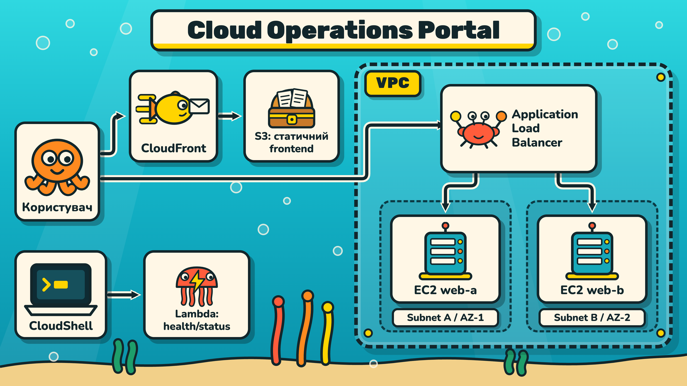

# Roadmap: змістовний модуль 1

## Технології хмарних обчислень

Модуль будується навколо одного наскрізного продукту: **Cloud Operations Portal**. Курсант поступово проєктує та розгортає середовище в AWS Academy Learner Lab.

## Наскрізний продукт



> **Альтернативне представлення:** ця ілюстрація доповнює Mermaid-схеми в матеріалах занять і показує ту саму архітектуру у візуальному форматі.

Фінальний продукт має показати:

- ізольовану VPC з двома subnet у різних Availability Zones;
- два EC2, доступні через Application Load Balancer;
- статичний frontend у S3, доставлений через CloudFront;
- Lambda-функцію для перевірки стану;
- перевірку відмови одного EC2;
- документацію, аудит і cleanup.

## Принцип організації занять

Одне заняття має один формат. Формати не змішуються всередині README.

| Заняття | Тип | Що робить викладач | Що робить курсант |
|---|---|---|---|
| 1.1 | Лекція | Пояснює основи хмарних обчислень | Слухає, ставить питання, фіксує модель |
| 1.2 | Лекція | Пояснює сервіси AWS і фінальну архітектуру | Готує питання та архітектурні рішення |
| 1.3 | Групове | Демонструє команди побудови VPC | Спостерігає та аналізує результат команд |
| 1.4 | Практика | Консультує та перевіряє мережеві контрольні точки | Самостійно проєктує й створює мережу |
| 1.5 | Групове | Демонструє розгортання сервісів поверх VPC | Спостерігає, занотовує, ставить питання |
| 1.6 | Практика | Консультує, приймає продукт і захист | Самостійно збирає, тестує й документує портал |

## Послідовність

### 1.1. Лекція: хмарні обчислення

Матеріал: [Lesson1_1](Lesson1_1/README.md)

Курсант отримує понятійну основу: IaaS, PaaS, SaaS, serverless, регіони, Availability Zones і shared responsibility. Команд AWS на лекції немає.

**Результат:** курсант може пояснити майбутню архітектуру та роль кожного сервісу.

### 1.2. Лекція: сервіси та архітектура

Матеріал: [Lesson1_2](Lesson1_2/README.md)

Викладач пояснює VPC, EC2, ALB, S3, CloudFront і Lambda та розбирає шлях статичного, динамічного й serverless-запиту. Команд AWS на лекції немає.

**Результат:** курсант розуміє архітектурні зв'язки та готує питання до демонстрації.

### 1.3. Групове: мережева демонстрація

Матеріал: [Lesson1_3](Lesson1_3/README.md)

Викладач у CloudShell показує повний процес створення VPC, Internet Gateway, subnet, route table і Security Group. Команди містять пояснення призначення прапорців і залежностей.

**Результат:** курсант бачить правильний алгоритм і розуміє, як перевіряти результат.

### 1.4. Практика: мережева основа

Матеріал: [Lesson1_4](Lesson1_4/README.md)

Курсант за власною схемою створює VPC, дві subnet, маршрути, NACL і Security Group. Покрокових команд у цьому README немає: вони були предметом групової демонстрації.

**Результат:** мережа збережена у стані, який використають усі наступні заняття.

### 1.5. Групове: демонстрація розгортання

Матеріал: [Lesson1_5](Lesson1_5/README.md)

Викладач показує запуск EC2, target group, ALB, S3 і Lambda на основі VPC з Lesson1_4. Команди мають коментарі, що пояснюють параметри та очікуваний результат.

**Результат:** курсант має приклад послідовності дій і може пояснити кожну залежність.

### 1.6. Практика: фінальна збірка та захист

Матеріал: [Lesson1_6](Lesson1_6/README.md)

Курсант самостійно додає до власної мережі EC2, ALB, S3, CloudFront і Lambda, проводить тестування, аудит безпеки, перевірку відмови та cleanup.

**Результат:** працездатний Cloud Operations Portal, фінальна схема та звіт у GitHub.

## Передача результату між заняттями

| Після | Передається далі |
|---|---|
| 1.1 | Поняття, вимоги, чернетка архітектури |
| 1.2 | Архітектура сервісів і шлях запитів |
| 1.3 | Розуміння алгоритму та команд VPC |
| 1.4 | Реальна VPC, subnet, маршрути та правила |
| 1.5 | Приклад повного розгортання сервісів |
| 1.6 | Фінальний продукт, звіт і cleanup |

Кожен практичний результат фіксується commit у GitHub. На наступному занятті не створюється друга VPC, якщо попередня вже є частиною проєкту.

## Артефакти модуля

```text
README.md
Lesson1_1/README.md
Lesson1_2/README.md
Lesson1_3/README.md
Lesson1_4/README.md
Lesson1_5/README.md
Lesson1_6/README.md
docs/
  network-architecture.md
  architecture-final.md
  resource-inventory.md
  security-checklist.md
  test-results.md
  cleanup-checklist.md
state/
  environment.example.env
```

## Загальні критерії оцінювання

| Критерій | Частка |
|---|---:|
| Архітектурне проєктування та схема | 20% |
| Працездатність продукту | 30% |
| Послідовність і передача стану | 15% |
| Безпека та тестування відмови | 20% |
| Документація та cleanup | 15% |

## Обмеження

- Усі ресурси створюються лише в AWS Academy Learner Lab.
- Регіон і доступні типи EC2 потрібно перевіряти у поточному Lab.
- Реальні ключі, секрети та приватні дані не публікуються.
- Після завершення роботи ресурси потрібно видалити або явно передати в наступний етап.
