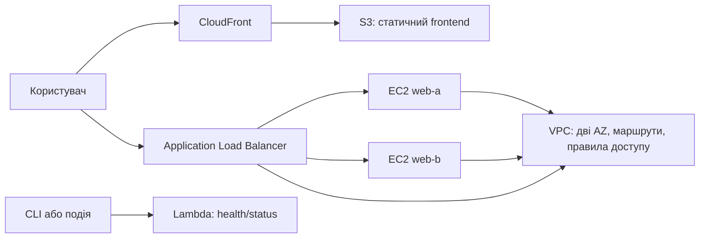

# Roadmap: змістовний модуль 1

## Технології хмарних обчислень

Цей roadmap описує наскрізний навчальний проєкт модуля. Курсант не виконує набір незалежних лабораторних робіт: після кожного етапу в нього залишається нова частина одного працездатного хмарного середовища.

## Наскрізний проєкт

### Cloud Operations Portal

Навчальний вебпортал, розгорнутий в AWS Academy Learner Lab. Портал показує стан середовища та використовується для демонстрації мережі, обчислень, сховища, доставки контенту, балансування і serverless-підходу.

Фінальний результат:



## Логіка навчання

| Формат | Роль викладача | Дія курсанта | Результат |
|---|---|---|---|
| Лекція | Пояснює теорію, архітектурні рішення і ставить вимоги | Слухає, ставить питання, фіксує рішення | Розуміння моделі та вимог до етапу |
| Групове заняття | Покроково демонструє команди, помилки та перевірки | Спостерігає, відповідає на короткі питання, виконує невелике завдання | Конспект команд і розуміння процесу |
| Практичне заняття | Консультує і перевіряє контрольні точки | Проєктує, виконує, перевіряє та документує | Нова працездатна частина проєкту |
| Самопідготовка | Формулює дослідницьке або проєктне завдання | Завершує етап, готує схему та коротке обґрунтування | Артефакти в GitHub і підготовка до наступного етапу |

Команди в README занять призначені для показу на груповому занятті. На практичному курсант отримує ціль, обмеження, архітектурну задачу і критерії готовності та сам обирає послідовність команд.

## Послідовність етапів

### Етап 0. Вимоги та архітектура

Матеріал: [Lesson1_1](Lesson1_1/README.md)

**Лекція:** хмарні моделі IaaS, PaaS, SaaS, serverless, регіони, Availability Zone, відповідальність провайдера і користувача.

**Групове:** викладач показує приклад вимог, схему рішення та структуру AWS-ресурсів.

**Практичне і самопідготовка:** курсант готує:

- короткий опис Cloud Operations Portal;
- схему бажаної фінальної архітектури;
- таблицю `потреба -> AWS-сервіс -> обґрунтування`;
- правила іменування ресурсів та checklist очищення.

**Контрольна точка:** у репозиторії є затверджена схема і список ресурсів.

### Етап 1. Мережева основа

Матеріал: [Lesson1_2](Lesson1_2/README.md)

**Лекція:** VPC, CIDR, subnet, Availability Zone, Internet Gateway, route table, Network ACL, Security Group, Elastic IP.

**Групове:** викладач створює VPC через CloudShell і демонструє перевірку кожного ресурсу. Курсант спостерігає та виконує коротке завдання: за CIDR-планом визначає, куди потрапить пакет і яке правило його обробить.

**Практичне і самопідготовка:** курсант за власною схемою створює мережу для майбутнього порталу:

- VPC `10.0.0.0/16`;
- дві subnet у різних AZ;
- Internet Gateway і public route table;
- окремі правила доступу для web і адміністративного доступу;
- перевірка маршрутизації та доступності.

**Артефакти:** схема мережі, таблиця CIDR, файл стану з ID ресурсів, коротке пояснення різниці NACL і Security Group.

**Критерій готовності:** ресурси створені в одному VPC, мають узгоджені теги, а їхні ID доступні наступному етапу.

### Етап 2. Обчислювальний шар

Матеріал: [Lesson1_3](Lesson1_3/README.md)

**Лекція:** EC2, AMI, user data, життєвий цикл інстансу, балансування, відмовостійкість і порівняння EC2 з Lambda та контейнерами.

**Групове:** викладач на вже створеній VPC запускає один тестовий EC2, встановлює вебсервер через user data, показує health check і підключає інстанс до ALB.

**Практичне і самопідготовка:** курсант продовжує власне середовище:

- запускає два EC2 у різних AZ;
- розгортає на них різні версії або ідентифікатори сторінки;
- створює target group і ALB;
- перевіряє розподіл запитів;
- зупиняє один інстанс і перевіряє збереження доступності.

**Артефакти:** схема шляху запиту, таблиця ресурсів, результати health check, висновок про відмовостійкість.

**Критерій готовності:** ALB передає HTTP-запити до здорових цілей у двох AZ.

### Етап 3. Зберігання та доставка контенту

Матеріал: [Lesson1_4](Lesson1_4/README.md)

**Лекція:** об'єктне сховище, S3, CDN, кеш, origin, CloudFront, DNS і принцип найменших прав.

**Групове:** викладач завантажує статичну сторінку до S3, створює CloudFront distribution і демонструє зміну об'єкта та поведінку кешу.

**Практичне і самопідготовка:** курсант готує frontend порталу, зберігає його в S3, підключає CloudFront, порівнює прямий доступ до origin і доступ через CDN та досліджує оновлення кешу.

**Критерій готовності:** frontend доступний через CloudFront, а курсант може пояснити шлях запиту.

### Етап 4. Serverless-компонент

Матеріал: [Lesson1_5](Lesson1_5/README.md)

**Лекція:** Lambda, події, runtime, cold start, IAM role, межі застосування serverless.

**Групове:** викладач створює функцію статусу, викликає її через CLI та показує формат відповіді.

**Практичне і самопідготовка:** курсант додає до порталу функцію `health/status`, яка повертає JSON зі станом середовища, і документує різницю між EC2 та Lambda.

**Критерій готовності:** функція викликається незалежно від EC2 і повертає перевірюваний результат.

### Етап 5. Безпека, спостережуваність і завершення

Матеріал: [Lesson1_6](Lesson1_6/README.md)

**Лекція:** shared responsibility, відкриті порти, IAM, CloudWatch, витрати AWS Academy, очищення ресурсів.

**Групове:** викладач показує типові помилки: надто широке правило, нездоровий target, залишений Elastic IP або CloudFront.

**Практичне і самопідготовка:** курсант проводить аудит відкритих портів, формує checklist перевірки, додає базові метрики або перевірки, готує фінальну схему, демонструє роботу порталу та видаляє ресурси в правильному порядку.

**Фінальний захист:** курсант пояснює архітектуру, шлях HTTP-запиту, вибір кожного сервісу, одну відмову та порядок очищення.

## Правило передачі результату між заняттями

Кожен етап завершується commit у GitHub і збереженням стану. Не можна повторно створювати VPC на наступному етапі, якщо вона вже є частиною проєкту.

Рекомендована структура результатів:

```text
README.md
Lesson1_1/README.md
Lesson1_2/README.md
Lesson1_3/README.md
Lesson1_4/README.md
Lesson1_5/README.md
Lesson1_6/README.md
docs/
  architecture-v1.md
  architecture-v2.md
  resource-inventory.md
  cleanup-checklist.md
state/
  environment.example.env
```

Файл із реальними ID ресурсів не слід публікувати, якщо це суперечить правилам середовища. У GitHub зберігається лише шаблон змінних і опис того, як відновити стан.

## Загальні критерії оцінювання

| Критерій | Частка |
|---|---:|
| Архітектурна обґрунтованість і схема | 20% |
| Працездатність хмарного середовища | 30% |
| Послідовність і повторюваність дій | 20% |
| Безпека та контроль доступу | 15% |
| Документація і пояснення рішень | 15% |

## Важливі обмеження

- Усі ресурси створюються в AWS Academy Learner Lab.
- Регіон і доступні типи інстансів потрібно перевіряти в поточному Lab.
- Публічні IP, відкритий SSH і публічний S3 використовуються лише для навчальної демонстрації та мають бути обґрунтовані.
- Після кожної роботи потрібно виконувати cleanup або чітко фіксувати, що ресурс переходить до наступного етапу.